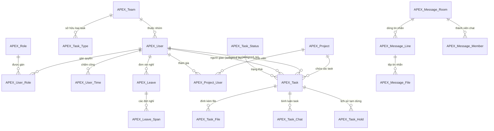

# BÁO CÁO PHÂN TÍCH TOÀN DIỆN CƠ SỞ DỮ LIỆU APEX (SUPABASE)
**Phiên bản:** 1.0.0  
**Hệ thống nguồn:** Supabase Legacy (`ejyirnfxuezipogweybo`)  
**Hệ thống đích:** Supabase Production (`wluhkzkfknpbunxagvjw`)  
**Ngày thực hiện:** 29/09/2026  
**Đơn vị thực hiện:** AI Assistant & Core Development Team  

---

## 1. TỔNG QUAN HỆ THỐNG DỮ LIỆU APEX

Hệ thống bảng mang tiền tố **`APEX_`** là nền tảng cơ sở dữ liệu cốt lõi phục vụ ứng dụng chuyên nghiệp của Apex Southern Cross Engineering (phần mềm Desktop C# / Tool quản trị kỹ thuật), kết hợp cùng Web App Weekly Report.

Hiện tại, hệ thống bao gồm **26 bảng dữ liệu độc lập** và **1 View tổng hợp**, toàn bộ đều được thiết lập ở trạng thái `UNRESTRICTED` (không chặn RLS mặc định, trao toàn quyền truy cập cho client đã được xác thực):

```
+------------------------------------------------------------------------------+
|                         HỆ SINH THÁI DỮ LIỆU APEX                            |
+------------------------------------------------------------------------------+
| [Nhân Sự & Quyền]       [Dự Án & Danh Mục]       [Công Việc & Tiến Độ]        |
| - APEX_User (26)        - APEX_Project (56)      - APEX_Task (2.077)         |
| - APEX_Team (5)         - APEX_Project_User (1)  - APEX_Task_File (444)      |
| - APEX_Role (5)                                  - APEX_Task_Type (61)       |
| - APEX_User_Role (28)                            - APEX_Task_Chat (18)       |
| - APEX_User_Time (9)                             - APEX_Task_Hold (14)       |
| - APEX_User_With_Roles*                          - APEX_Task_Status (6)      |
|                                                  - APEX_Task_Reaction (0)    |
|                                                  - APEX_Task_Read (0)        |
|                                                  - APEX_Task_Share (0)       |
+------------------------------------------------------------------------------+
| [Tin Nhắn & Trao Đổi]    [Nghỉ Phép & Công]       [Cấu Hình & Thông Báo]      |
| - APEX_Message_Line (68)- APEX_Leave (2)         - APEX_Notify (105)         |
| - APEX_Message_Member(34- APEX_Leave_Span (5)    - APEX_App_Setting (4)      |
| - APEX_Message_File (16)- APEX_TimeSheet (0)                                 |
| - APEX_Message_Room (14)                                                     |
| - APEX_Message_Direct(9)                                                     |
+------------------------------------------------------------------------------+
(*) View tổng hợp
```

---

## 2. SƠ ĐỒ THỰC THỂ QUAN HỆ (ERD - ENTITY RELATIONSHIP)



---

## 3. PHÂN TÍCH CHI TIẾT TỪNG PHÂN HỆ VÀ DỮ LIỆU THỰC TẾ

### Phân Hệ 1: Nhân Sự, Tổ Chức & Phân Quyền (RBAC)

Phân hệ này quản lý toàn bộ nhân viên, đội nhóm chuyên môn và hệ thống phân quyền 5 cấp bậc nghiêm ngặt:

1. **`APEX_Team` (5 bản ghi)**:
   * Danh sách 5 phòng ban kỹ thuật:
     * `ENGINEER`: Kỹ sư kết cấu.
     * `ETABS`: Tính toán, mô hình hóa phân tích nội lực kết cấu.
     * `PT&REO`: Thiết kế ứng lực trước (Post-Tensioning) và cốt thép (Rebar).
     * `MODELLING`: Triển khai mô hình BIM / Revit.
     * `MANAGER`: Ban điều hành, quản lý tiến độ.
   * Có cột `nas_path` nhằm ánh xạ trực tiếp đến ổ cứng mạng nội bộ (NAS) của công ty.

2. **`APEX_Role` (5 bản ghi)**:
   * Hệ thống vai trò được xếp hạng (`rank` từ 1 đến 5):
     * `user` (Rank 1): Drafter / Nhân viên triển khai.
     * `assistant` (Rank 2): Trợ lý dự án / Kỹ thuật viên hỗ trợ.
     * `leader` (Rank 3): Trưởng nhóm bộ phận, duyệt task, phân công việc.
     * `admin` (Rank 4): Quản trị viên dự án & kỹ thuật.
     * `admin_app` (Rank 5): Quản trị viên cao nhất của hệ sinh thái ứng dụng.
   * Chứa tới **20 cờ phân quyền chi tiết (Boolean flags)**: `see_all`, `can_assign`, `can_write`, `can_delete`, `can_approve`, `project_add/edit/delete`, `user_add/edit/delete`, `can_purge`, `can_manage_admins`...

3. **`APEX_User` (26 bản ghi)**:
   * Danh sách 26 kỹ sư / drafter chính thức:
     * **Theo nhóm:** `ENGINEER` (7), `MODELLING` (7), `PT&REO` (7), `MANAGER` (3), `ETABS` (2).
     * **Theo vai trò:** `User` (13 nhân sự), `Leader` (8 nhân sự), `Admin` (4 nhân sự), `AdminApp` (1 nhân sự).
   * Chứa đầy đủ thông tin: `email`, `full_name`, `position`, `manager_id`, `layout`, `password`, `team_id`.

4. **`APEX_User_Role` (28 bản ghi)**:
   * Bảng trung gian gán nhiều vai trò cho một tài khoản (User - Role Many-to-Many).

5. **`APEX_User_Time` (9 bản ghi)**:
   * Ghi nhận lịch sử giờ mở máy (`first_on`) và giờ tắt máy (`last_off`) phục vụ kiểm soát thời gian làm việc tự động từ app C#.

6. **`APEX_User_With_Roles` (View)**:
   * View gom nhóm `APEX_User` kèm mảng `roles: ["user", "leader", ...]` để ứng dụng gọi API nhanh trong 1 query.

---

### Phân Hệ 2: Quản Lý Dự Án (Projects)

1. **`APEX_Project` (56 bản ghi)**:
   * 56 dự án công trình tiêu biểu tại Úc và quốc tế:
     * Ví dụ: `FGWB` (*Fitzroy Gasworks Parcel B*), `UPPER HEIDELBERG` (*455 Upper Heidelberg Road*), `CONTITECH` (*Contitech Bayswater*), `VIC AVENUE` (*410 Victoria Avenue*), `LOT 14` (*Lot Fourteen*)...
   * Quản lý phiên bản Revit cụ thể cho từng công trình (`revit_version`: 2022, 2024, 2025).
   * Mã màu đại diện (`color`), ảnh đại diện (`image`), mã dự án (`key`), số thứ tự (`number`).

2. **`APEX_Project_User` (1 bản ghi)**:
   * Thiết lập quyền truy cập dự án chuyên biệt cho từng nhân sự (Project Assignment).

---

### Phân Hệ 3: Quản Lý Công Việc & Luồng Kỹ Thuật (Task Engine)

Đây là phân hệ đồ sộ nhất, thể hiện toàn bộ lịch sử thiết kế và mô hình hóa công trình:

1. **`APEX_Task` (2.077 bản ghi - Hub dữ liệu trung tâm)**:
   * **Cấu trúc 30 cột dữ liệu chuẩn hóa:**
     * **Định danh & Quan hệ:** `id` (PK UUID), `project_id` (Dự án), `parent_id` (Task cha/WBS), `assigned_to_id` (Người nhận), `assigned_by_id` (Người giao), `create_by_id` / `update_by_id`, `create_by` / `update_by`.
     * **Nội dung & Phân loại:** `name` (Tên task), `detail` (Mô tả kỹ thuật), `folder` (Thư mục bản vẽ), `check_only` (Cờ chỉ kiểm tra), `area` (Diện tích m² sàn), `layout`.
     * **Tiến trình thời gian:** `planned_start`, `planned_end`, `started_at`, `checked_at`, `completed_at`, `seen_at`.
     * **Giờ công & Hiệu suất:** `hours_planned`, `hours_complete`, `hours_ot`, `ot_note`, `progress` (% tiến độ).
     * **Đánh giá & Trạng thái:** `status` (0: Complete, 1: New, 2: Start, 3: Checked, 5: Hold), `review_comment`.

   * **Cơ chế tính toán giờ công trong `APEX_Task`:**
     * **Giờ kế hoạch (`hours_planned`):**
       $$\mathbf{hours\_planned = \frac{planned\_end - planned\_start}{3600 \text{ giây}}}$$
       *(Ví dụ: 03:41:00 đến 04:00:00 = 19 phút $\rightarrow 19 / 60 \approx 0.3167$ giờ).*
     * **Giờ thực tế hoàn thành (`hours_complete`):**
       $$\mathbf{hours\_complete = \frac{completed\_at - started\_at}{3600 \text{ giây}} - \text{Thời gian Hold (nếu có)}}$$
       *(Ví dụ: Bắt đầu 03:48:37, nghiệm thu 04:00:32 = 715.05 giây $\rightarrow 715.05 / 3600 \approx 0.1986$ giờ).*
     * **Quy chuẩn ca làm việc hành chính (Working Hours Filtering):**
       * Ca sáng: `08:30 - 12:30` (4 giờ).
       * Nghỉ trưa: `12:30 - 13:30` (1 giờ **loại trừ**, không tính vào giờ làm).
       * Ca chiều: `13:30 - 17:30` (4 giờ).
       * Chuẩn 1 ngày: `8 giờ` (480 phút làm việc). Tự động loại trừ Thứ 7 và Chủ Nhật.
     * **Đo lường hiệu suất (Efficiency & Variance):**
       * $\Delta Hours = hours\_complete - hours\_planned$:
         * **44.2% (765 tasks)** hoàn thành sớm hơn kế hoạch (*Under budget*).
         * **55.8% (966 tasks)** vượt giờ kế hoạch (*Over budget* - chủ yếu do phát sinh Revision/Markup từ khách hàng).
       * Tỷ lệ hiệu suất: $Efficiency = (hours\_planned / hours\_complete) \times 100\%$.
     * **Quy tắc task chỉ kiểm tra (`check_only = true`):**
       * Chiếm **235 tasks (11.3%)**.
       * Giờ kiểm tra thực tế: $Time_{Check} = \text{Tổng giờ Leader} - \max(\text{Giờ Drafter làm task con})$.

   * **Số liệu thống kê thực tế:**
     * **Tổng giờ kế hoạch:** `11.722,2 giờ` (TB ~5.91 giờ/task).
     * **Tổng giờ thực tế:** `18.543,3 giờ` (TB ~10.25 giờ/task).
     * **Phân bố trạng thái:** `Complete`: 2.053 (98.8%), `Checked`: 8, `New`: 7, `Start`: 6, `Hold`: 3.
     * **Cây công việc (Sub-tasks với `parent_id`):** `256 tasks`.
     * **Top 5 Dự án nhiều việc nhất:** District Living (307 tasks), Fitzroy Gasworks (299), 31 The Avenue (250), Leeds St (154), Macaulay Road (111).
     * **Top nhân sự nhận task:** Khánh Nguyễn (276), Nguyên Lý (266), Hoàng Phạm (249), Trung Nguyễn (246), Ánh Nguyễn (205).
     * **Top người điều phối:** Cường Phạm (1.056 tasks), Johnny Nguyễn (589 tasks), Neil Lý (240 tasks).
     * **Thư mục bản vẽ (`folder`):** `_GA PLAN` (304), `_ELEVATION WALL` (98), `_LOADING PLAN` (93), `_SECTION DETAILS` (65), `_FULL SET` (49), `_COLUMN` (29), `_FOUNDATION` (23)...

2. **`APEX_Task_File` (444 bản ghi)**:
   * Lưu trữ các bản vẽ PDF, markup, tệp DWG đính kèm trực tiếp vào từng task.
   * Liên kết với Supabase Storage qua `storage_key`.

3. **`APEX_Task_Type` (61 bản ghi)**:
   * Danh mục 61 loại công việc kỹ thuật chuẩn hóa theo từng bộ phận (ví dụ: `_PT EXTENSION CHECK`, `MARKUP - STEEL`, `REBAR DETAILING`...).

4. **`APEX_Task_Status` (6 bản ghi)**:
   * Bảng từ điển định nghĩa mã và nhãn hiển thị: `Complete`, `New`, `Start`, `Checked`, `ReChecked`, `Hold`.

5. **`APEX_Task_Chat` (18 bản ghi) & `APEX_Task_Hold` (14 bản ghi)**:
   * `APEX_Task_Chat`: Ghi nhận các thảo luận ngay tại đầu việc, tránh phân tán thông tin.
   * `APEX_Task_Hold`: Ghi nhận nguyên nhân vì sao công việc bị ách tắc (`caused_by_task_id`, thời điểm bắt đầu - kết thúc nghẽn) để quản trị rủi ro dự án.

6. **`APEX_Task_Reaction`, `APEX_Task_Read`, `APEX_Task_Share` (0 bản ghi)**:
   * Các bảng tính năng tương tác mạng xã hội nội bộ (thả icon cảm xúc, theo dõi ai đã xem task, phân quyền chia sẻ task), hiện đã có sẵn schema sẵn sàng kích hoạt.

---

### Phân Hệ 4: Nghỉ Phép & Quản Lý Thời Gian (Leaves & Timesheet)

1. **`APEX_Leave` (2 bản ghi) & `APEX_Leave_Span` (5 bản ghi)**:
   * Quản lý đơn xin nghỉ phép số hóa:
     * Người xin (`user_id`), Người duyệt (`approver_id`), Người liên quan được nhận thông báo (`cc_id`).
     * Trạng thái duyệt: `draft`, `pending`, `approved`, `rejected` kèm lời phản hồi `reply`.
     * `APEX_Leave_Span`: Cho phép một đơn nghỉ phép chia thành nhiều khoảng thời gian không liên tục (`start_at` -> `end_at`).

2. **`APEX_TimeSheet` (0 bản ghi)**:
   * Schema quản lý bảng chấm công theo tuần (`week`) và năm (`year`) cho từng dự án, đã sẵn sàng để ứng dụng đồng bộ định kỳ.

---

### Phân Hệ 5: Hệ Thống Chat, Trao Đổi Kỹ Thuật (Internal Communication)

Hệ thống tin nhắn tức thời được thiết kế bài bản tương tự Slack / MS Teams thu nhỏ:

1. **`APEX_Message_Room` (14 phòng chat)**:
   * Phân loại:
     * `direct`: Trò chuyện riêng giữa 2 cá nhân (ví dụ: Johnny Nguyen & Vu Do Nguyen).
     * `group`: Nhóm làm việc bộ phận (ví dụ: *MODELING TEAM NEW*).
     * `task`: Phòng thảo luận gắn chặt với một mã đầu việc cụ thể (ví dụ: *TRAINING: NEW SETUP*).
   * Lưu vết tin nhắn cuối (`last_preview`, `last_at`).

2. **`APEX_Message_Line` (68 tin nhắn)**:
   * Nội dung trao đổi, hỗ trợ định dạng text, thông báo cuộc gọi (`call`), trả lời trích dẫn (`reply_to_id`), ghim tin nhắn (`is_pinned`).

3. **`APEX_Message_Member` (34 thành viên)**:
   * Quản lý thành viên trong từng phòng chat, cờ quản trị viên nhóm (`is_admin`), mốc xem tin nhắn cuối để hiển thị chấm chưa đọc (`last_read_at`).

4. **`APEX_Message_Direct` (9 cặp)**:
   * Cặp khóa tối ưu `(user_lo, user_hi)` đảm bảo giữa 2 người chỉ tồn tại duy nhất 1 phòng chat trực tiếp, không bị trùng lặp.

5. **`APEX_Message_File` (16 tệp tin nhắn)**:
   * Quản lý file gửi qua khung chat (hồ sơ PDF, ảnh chụp màn hình bản vẽ kỹ thuật), lưu trực tiếp trên bucket `apex-message`.

---

### Phân Hệ 6: Thông Báo & Cài Đặt (Notifications & Settings)

1. **`APEX_Notify` (105 thông báo)**:
   * Hệ thống thông báo đẩy (In-app notifications) gửi đến từng kỹ sư khi có task mới, tin nhắn mới hoặc đơn nghỉ phép được duyệt.
   * Cột `is_read` quản lý trạng thái đã đọc / chưa đọc.

2. **`APEX_App_Setting` (4 cấu hình)**:
   * Lưu các biến môi trường toàn cục của phần mềm C#, ví dụ đường dẫn thư mục máy chủ NAS (`nas_path`).

---

## 4. TỔNG HỢP DANH MỤC 27 BẢNG VÀ VIEW

| STT | Tên Bảng / View | Loại | Số Bản Ghi | Khóa Chính (PK) | Mục Đích Nghiệp Vụ |
| :---: | :--- | :---: | :---: | :--- | :--- |
| **1** | `APEX_App_Setting` | Table | 4 | `key` | Cấu hình toàn cục phần mềm Desktop |
| **2** | `APEX_Team` | Table | 5 | `id` | Danh mục phòng ban kỹ thuật (BIM, ETABS...) |
| **3** | `APEX_Role` | Table | 5 | `id` | Bảng phân quyền 5 cấp bậc với 20 quyền con |
| **4** | `APEX_User` | Table | 26 | `id` | Danh bạ kỹ sư, tài khoản, mật khẩu, nhóm |
| **5** | `APEX_User_Role` | Table | 28 | `(user_id, role_id)` | Quan hệ phân quyền đa năng cho người dùng |
| **6** | `APEX_User_Time` | Table | 9 | `id` | Ghi nhận thời gian online/offline làm việc |
| **7** | `APEX_Project` | Table | 56 | `id` | Hồ sơ dự án, mã công trình, phiên bản Revit |
| **8** | `APEX_Project_User` | Table | 1 | `id` | Phân công nhân sự theo dự án cụ thể |
| **9** | `APEX_Task_Status` | Table | 6 | `status` | Danh mục trạng thái công việc chuẩn hóa |
| **10** | `APEX_Task_Type` | Table | 61 | `id` | Danh mục 61 loại công việc kỹ thuật |
| **11** | `APEX_Task` | Table | **2.077** | `id` | Cơ sở dữ liệu công việc, tiến độ, số giờ |
| **12** | `APEX_Task_Chat` | Table | 18 | `id` | Trao đổi nội bộ đính kèm trong từng task |
| **13** | `APEX_Task_File` | Table | **444** | `id` | Danh mục bản vẽ PDF, markup đính kèm task |
| **14** | `APEX_Task_Hold` | Table | 14 | `id` | Lịch sử và nguyên nhân ách tắc công việc |
| **15** | `APEX_Task_Reaction`| Table | 0 | `id` | Thả icon cảm xúc vào công việc |
| **16** | `APEX_Task_Read` | Table | 0 | `(task_id, user_id)` | Đánh dấu người đã xem thông tin task |
| **17** | `APEX_Task_Share` | Table | 0 | `id` | Chia sẻ task cho người ngoài nhóm |
| **18** | `APEX_Leave` | Table | 2 | `id` | Đơn xin nghỉ phép trực tuyến |
| **19** | `APEX_Leave_Span` | Table | 5 | `id` | Chi tiết các khoảng thời gian xin nghỉ |
| **20** | `APEX_Message_Room` | Table | 14 | `id` | Phòng chat riêng, nhóm hoặc theo task |
| **21** | `APEX_Message_Line` | Table | 68 | `id` | Dòng tin nhắn văn bản, log cuộc gọi |
| **22** | `APEX_Message_Member`| Table| 34 | `(room_id, user_id)`| Thành viên và trạng thái đọc tin trong nhóm |
| **23** | `APEX_Message_Direct`| Table| 9 | `(user_lo, user_hi)` | Định danh kênh chat đôi chống trùng lặp |
| **24** | `APEX_Message_File` | Table | 16 | `id` | Tệp và hình ảnh trao đổi qua tin nhắn |
| **25** | `APEX_Notify` | Table | 105 | `id` | Hộp thư thông báo hệ thống gửi nhân viên |
| **26** | `APEX_TimeSheet` | Table | 0 | `id` | Bảng chấm công định kỳ theo tuần |
| **27** | `APEX_User_With_Roles`| View | 26 | `id` | View tổng hợp thông tin nhân sự + mảng Role |

---

## 5. SO SÁNH GIỮA HỆ THỐNG BẢNG `APEX_` VÀ `NMK_`

Trong cơ sở dữ liệu Supabase mới (`wluhkzkfknpbunxagvjw`), hiện tồn tại song song 2 nhóm bảng:

| Đặc Điểm So Sánh | Nhóm Bảng `APEX_...` | Nhóm Bảng `NMK_...` |
| :--- | :--- | :--- |
| **Nền tảng sử dụng chính** | Phần mềm Desktop C# / Tool kỹ thuật nội bộ | Web App Weekly Report (React + Vite) |
| **Khóa chính & Quan hệ** | Sử dụng triệt để `UUID` chuẩn, quan hệ FK rõ ràng | Dùng kết hợp UUID và String/Email |
| **Tính năng giao tiếp** | Có sẵn Chat, Message Room, File Chat | Chưa có module chat riêng |
| **Tính năng kiểm soát task**| Quản lý `hours_planned`, `hours_complete`, `hours_ot`, `area`, `folder` chi tiết | Quản lý task theo ngày, timeline đơn giản |
| **Thư viện chuẩn (Library)**| Chưa tích hợp thư viện mẫu | Có `NMK_Library_Room`, `Workflow`, `Spread` |

> 💡 **Khuyến nghị kiến trúc:**  
> Hệ thống bảng `APEX_` có thiết kế chuẩn hóa và toàn diện hơn về mặt mô hình quan hệ cơ sở dữ liệu doanh nghiệp. Việc đã chuyển toàn bộ 27 bảng này sang Supabase mới mở ra cơ hội **hợp nhất dữ liệu (Data Unification)** giữa ứng dụng Desktop C# và ứng dụng Web trong tương lai gần, giúp nhân sự chỉ cần dùng 1 hệ tài khoản và dữ liệu được đồng bộ hóa tức thì (Real-time).

---

## 6. LƯU Ý BẢO MẬT & VẬN HÀNH TIẾP THEO

1. **Về cơ chế bảo mật (Row Level Security):**
   * Hiện tại, các bảng `APEX_` đang ở chế độ `DISABLE ROW LEVEL SECURITY` (đúng chuẩn hoạt động của hệ thống cũ để các client Desktop kết nối thuận lợi).
   * Khi ứng dụng mở rộng cho người dùng bên ngoài qua Internet, có thể cân nhắc kích hoạt RLS và thiết lập chính sách (Policies) dựa trên bảng `APEX_Role`.

2. **Về Storage Buckets:**
   * Các tệp tin trong `APEX_Task_File` và `APEX_Message_File` đang liên kết với bucket Supabase Storage (ví dụ: `apex-message`).
   * Cần đảm bảo trên Supabase mới đã tạo sẵn bucket `apex-message` (Public) để các hình ảnh và file PDF trong tin nhắn hiển thị bình thường.

3. **Toàn vẹn dữ liệu:**
   * Toàn bộ mã nguồn backup đã được lưu vĩnh viễn tại thư mục `Report/scratch/apex_backup/`.
   * File script nạp dữ liệu tự động `Report/scratch/migrate_apex_data.js` có thể tái sử dụng bất kỳ lúc nào nếu cần phục hồi dữ liệu.
