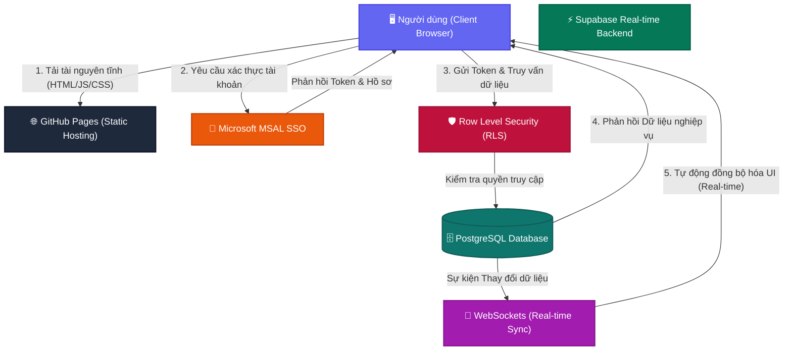

# Phân tích Kiến trúc Hệ thống (System Architecture Analysis)
**Phiên bản:** v5.0.0 (Overhaul & Optimization)  
**Ngày cập nhật:** 2026-05-17  
**Tác giả:** Antigravity AI Assistant & Engineering Team  

Tài liệu này phân tích chi tiết cấu trúc kiến trúc hiện tại của ứng dụng **Weekly Report Web** sau đợt đại trùng tu mã nguồn **V5.0.0**. Hệ thống là sự kết hợp tối ưu giữa mô hình lưu trữ tĩnh phân tán (GitHub Pages), cơ sở dữ liệu thời gian thực (Supabase), cơ chế xác thực doanh nghiệp (Microsoft MSAL SSO), và hệ thống thiết kế Neumorphic hiện đại.

---

## 1. Bản đồ Kiến trúc Tổng thể (Global Architecture Map)

Sơ đồ dưới đây thể hiện luồng tương tác giữa người dùng, môi trường phân phối tĩnh (GitHub Pages), hệ thống xác thực (Microsoft SSO), và lớp dữ liệu động thời gian thực (Supabase).



---

## 2. Các Trụ cột Kiến trúc Cốt lõi (Core Architectural Pillars)

### 2.1. Frontend & Phân phối Tĩnh (GitHub Pages / Vite)
*   **Trình đóng gói (Vite 8.0)**: Cung cấp tốc độ Hot Module Replacement (HMR) cực nhanh trong môi trường phát triển và tối ưu hóa dung lượng bundle khi production build.
*   **Hosting tĩnh**: Toàn bộ UI được biên dịch thành các file HTML, JS, và CSS tĩnh và host miễn phí trên **GitHub Pages** (base path: `/Report/`), giảm thiểu tối đa chi phí vận hành và tăng độ ổn định.
*   **CI/CD Tự động**: Mỗi khi code được push lên nhánh `main`, một luồng **GitHub Actions** tự động chạy kiểm tra linting, build ứng dụng và deploy lên server.

### 2.2. Backend & Real-time (Supabase Integration)
Supabase đóng vai trò là "trái tim" dữ liệu của hệ thống, cung cấp các dịch vụ Backend-as-a-Service (BaaS) linh hoạt:
*   **PostgreSQL Database**: Lưu trữ các bảng dữ liệu chuẩn hóa bao gồm:
    *   `Tasks` (Nhiệm vụ hàng tuần, ngày thực hiện, thời gian, trạng thái).
    *   `Users` (Danh sách nhân sự, email, quyền hạn, team).
    *   `Projects` (Thông tin dự án, mã dự án, trạng thái live).
    *   `Annual Leave` (Đăng ký nghỉ phép, duyệt nghỉ phép).
*   **WebSockets (Real-time Broadcast & Channels)**: Khi một Leader duyệt phép hoặc một User cập nhật task mới, Supabase sẽ phát tín hiệu qua WebSocket. Giao diện của tất cả các User khác có liên quan sẽ lập tức tự động cập nhật mà không cần tải lại trang.
*   **Supabase Client (`supabaseService.js`)**: Điểm giao tiếp tập trung và đồng nhất cho toàn bộ các truy vấn dữ liệu nghiệp vụ, hỗ trợ tự động chuẩn hóa dữ liệu đầu vào.

### 2.3. Hệ thống Quản lý Trạng thái Toàn cục (Global Tri-Context System)
Để loại bỏ triệt để hiện tượng truyền thuộc tính qua nhiều cấp (**Prop Drilling**), hệ thống đã được tái cấu trúc thành 3 lớp Context độc lập, đảm bảo hiệu năng tối ưu và dễ dàng mở rộng:

1.  **AuthContext (`AuthContext.jsx`)**:
    *   Quản lý trạng thái đăng nhập, thông tin người dùng hiện tại (`user`).
    *   Xác định quyền hạn truy cập (`isAdmin`, `isLeader`).
    *   Xử lý chế độ **Admin Bypass** (`?admin_mode=true`) phục vụ lập trình và thử nghiệm độc lập.
2.  **AppContext (`AppContext.jsx`)**:
    *   Quản lý các trạng thái toàn cục của UI: Tab hiện tại (`activeTab`), trạng thái đóng/mở Sidebar (`sidebarCollapsed`), cấu hình hình nền (`background` - Galaxy/Bamboo/Minimal), cấu hình chủ đề hiển thị (`theme`).
    *   Quản lý bộ đệm dữ liệu nghiệp vụ chính (`reportData`, `allProjects`, `weekDates`).
    *   Centralized Handlers: Các hàm thêm/sửa/xóa task đều được tập trung tại đây và đồng bộ trực tiếp với Supabase.
3.  **NotificationContext (`NotificationContext.jsx`)**:
    *   Lắng nghe trực tiếp các sự kiện thay đổi dữ liệu thời gian thực từ Supabase.
    *   Phân phát thông báo (thêm task mới, đổi trạng thái) dạng popover tương tác trong `TopBar`.

---

## 3. Quy trình Vận hành & Luồng dữ liệu (Data & Operation Flows)

```
[Người dùng thao tác] 
         │
         ▼
[Centralized Handlers (AppContext)]
         │
         ▼
[Supabase Client (supabaseService.js)]
         │
  ┌──────┴────────────────────────┐
  ▼ (Kiểm tra RLS)                ▼ (Offline fallback)
[Database (Supabase)]       [Local Storage Cache]
  │
  ├─► [Real-time WebSockets] ─► [NotificationContext] ─► [TopBar Ring Bell]
  │
  ▼ (Phản hồi thành công)
[UI Cập nhật tức thời (Optimistic UI / State Sync)]
```

### 3.1. Phân quyền hiển thị dữ liệu động (Data Visibility Rules)
Quy tắc bảo mật dữ liệu được áp đặt cứng từ phía frontend và bảo mật sâu ở phía backend (RLS):
*   **Quyền Super Admin / Leader**: Được truy vấn và hiển thị toàn bộ nhiệm vụ của tất cả nhân sự, quản lý được bảng cấu hình hệ thống (`AdminPanel`) và sơ đồ tổ chức tổng (`OrgChart`).
*   **Quyền Staff (User thường)**: Hệ thống tự động kích hoạt bộ lọc cứng (`Self-Data Filtering`). Dữ liệu hiển thị tại tab **Personal (My Workspace)**, **Weekly Report**, hay phân tích dữ liệu đều chỉ hiển thị các bản ghi thuộc sở hữu của chính User đó (dựa trên email đã xác thực qua SSO).

### 3.2. Cơ chế Bảo mật bổ sung (Security & Access Control)
*   **Row Level Security (RLS)**: Các bảng dữ liệu trên Supabase được bảo vệ nghiêm ngặt bằng chính sách RLS. Một client bất kỳ nếu không mang token xác thực hợp lệ sẽ bị PostgreSQL từ chối truy vấn ngay lập tức.
*   **Admin Bypass Mode (`?admin_mode=true`)**: Cho phép lập trình viên hoặc tester truy cập thẳng vào giao diện quản trị với vai trò `Super Admin` giả lập mà không cần qua cổng đăng nhập Microsoft. Tính năng này được kích hoạt linh hoạt nhưng được giới hạn phạm vi an toàn nhờ cơ chế kiểm tra môi trường phát triển (Development / Localhost environment checks).

---

## 4. Ngôn ngữ thiết kế & Thẩm mỹ (Tactile Neumorphism)

Hệ thống sở hữu một diện mạo hiện đại và vô cùng cao cấp:
*   **Chủ đề Đa dạng (Theme System)**: Sử dụng các biến HSL tùy chỉnh (Galaxy - Sleek Dark Mode và Bamboo - Fresh Light Mode) gán vào thẻ `<body>`. Màu sắc giao diện chuyển đổi mượt mà mà không cần load lại trang.
*   **Hiệu ứng Xúc giác (Tactile UI / Neumorphism)**:
    *   Các nút bấm dạng nổi (`.neu-button`, `.neu-raised`) và lõm (`.neu-inset`) tạo chiều sâu 3D chân thực, phản hồi tinh tế khi hover/click.
    *   Bóng đổ thông minh (`Theme-Aware Shadows`) tự động điều chỉnh độ tương phản theo theme sáng/tối.
*   **Giao diện 3D Chân thực (3D Bookshelf & Open Book)**:
    *   Tab **Projects** sở hữu giao diện kệ sách gỗ Mahogany 3D chân thực, các quyển sách đại diện cho từng dự án với màu sắc tương ứng.
    *   Trải nghiệm mở sách 3D tương tác sinh động khi xem chi tiết dự án.
    *   Linh vật mèo cam 3D nhảy nhót và nghỉ ngơi trên các cuốn sách đang chọn, tăng tính tương tác cao.

---

## 5. Kiến trúc CSS Module Tập trung (Atomic CSS Hub)

Sau đợt tái cấu trúc, toàn bộ hệ thống CSS đã được chuyển sang mô hình **Atomic CSS Hub** để quản lý dễ dàng và giải quyết triệt để tình trạng phân mảnh/xung đột CSS:
*   **Trạm trung chuyển (`index.css`)**: Hoạt động như một "Router" duy nhất quản lý toàn bộ các file CSS con trong dự án. Các Component (`TopBar.jsx`, `Sidebar.jsx`,...) không còn import CSS lẻ tẻ trực tiếp nữa.
*   **Phân lớp CoreUi**: Chứa các file cốt lõi định hình toàn bộ thiết kế hệ thống như `00_tokens.css` (biến màu sắc, kích thước) và `theme.css`. Phân lớp này luôn được nạp đầu tiên.
*   **Phân lớp PartUi**: Chứa các mảnh ghép nhỏ được tái sử dụng:
    *   `Elements/`: Gồm các nút bấm (`buttons.css`), thanh cuộn (`scrollbars.css`), bảng (`setting_table.css`), form nhập liệu.
    *   `Layouts/`: Định dạng các vùng bao bọc lớn như `00_navigation.css`.
    *   `Pages/`: Các CSS chuyên biệt cho từng màn hình (`profile.css`, `01_dashboard.css`...).

## 6. Tiêu chuẩn Tổ chức Không gian làm việc (Workspace Cleanliness)

Để đảm bảo khả năng duy trì (Maintainability) ở mức doanh nghiệp, cấu trúc thư mục vật lý đã được quy hoạch lại với tính kỷ luật cao:
*   **Kho Tài liệu Trung tâm (`Report/core/`)**: Toàn bộ các file thiết kế hệ thống (`_plan.md`), audit giao diện (`99_Overview.md`), và tài liệu hướng dẫn được gom về đây. `core/` hoạt động như "não bộ" của dự án (vô hình với máy chủ Vite khi build).
*   **Phân lập Dữ liệu Tạm & Rác (`temp_data/`)**: Các file script test API tạm thời, file CSV/Excel mock data, hoặc các template rời rạc (`Animated-Cat-Loader-main`) được đẩy ra thư mục này để không làm bẩn mã nguồn `src/`.
*   **Lưu trữ Dự phòng Tập trung (`Backup/`)**: Các bản sao chép mã nguồn (`src_backup_...`), hay thư mục lịch sử đều được gom chung vào một két sắt an toàn bên ngoài dự án.
*   **Bất khả xâm phạm (`public/`, `docs/`, Root configs)**: Các file cấu hình chuẩn của Vite/NPM (`package.json`, `vite.config.js`) và tài sản tĩnh (`public/`) được giữ nguyên tại gốc dự án theo đúng chuẩn mực công nghiệp.
