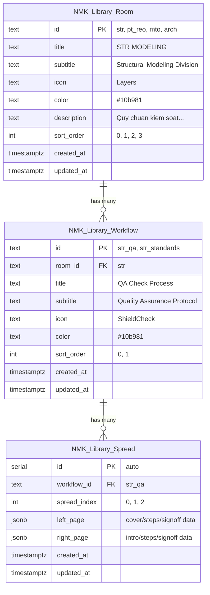

# Supabase Data Structure — Chi tiết đầy đủ

## Tổng quan kiến trúc

Dữ liệu Library được tổ chức theo 3 cấp: **Room → Workflow → Spread**, ánh xạ 1:1 với UI hiện tại:



---

## Bảng 1: `NMK_Library_Room` — Divisions (Rooms)

### Định nghĩa cột

| Cột | Kiểu | Constraint | Mô tả | Ví dụ |
|-----|------|-----------|-------|-------|
| `id` | `TEXT` | **PRIMARY KEY** | ID duy nhất, slug format | `'str'` |
| `title` | `TEXT` | `NOT NULL` | Tên hiển thị chính (tiêu đề division) | `'STR MODELING'` |
| `subtitle` | `TEXT` | `NULL OK` | Phụ đề mô tả ngắn | `'Structural Modeling Division'` |
| `icon` | `TEXT` | `DEFAULT 'Layers'` | Tên Lucide icon (map frontend) | `'Layers'`, `'Zap'`, `'FileText'`, `'Home'` |
| `color` | `TEXT` | `DEFAULT '#10b981'` | Hex color cho branding | `'#10b981'`, `'#f59e0b'` |
| `description` | `TEXT` | `NULL OK` | Mô tả dài (hiện dùng cho `desc`) | `'Quy chuẩn kiểm soát...'` |
| `sort_order` | `INT` | `DEFAULT 0` | Thứ tự hiển thị trên sidebar icons | `0`, `1`, `2`, `3` |
| `created_at` | `TIMESTAMPTZ` | `DEFAULT now()` | Thời gian tạo | auto |
| `updated_at` | `TIMESTAMPTZ` | `DEFAULT now()` | Thời gian cập nhật cuối | auto |

### Data mẫu — 4 Rooms

| id | title | subtitle | icon | color | description | sort_order |
|----|-------|----------|------|-------|-------------|------------|
| `str` | STR MODELING | Structural Modeling Division | Layers | #10b981 | Quy chuẩn kiểm soát chất lượng mô hình 3D kết cấu, QA/QC bản vẽ dầm cột sàn và thiết lập hệ tọa độ chia sẻ. | 0 |
| `pt_reo` | PT & REO | Post-Tension & Reinforcement Division | Zap | #f59e0b | Quản lý đường cáp dự ứng lực, cốt thép xoắn kháng nứt anchorage và bố trí cốt thép đai chịu lực cắt lớn beam-column joints. | 1 |
| `mto` | MTO | Maker to order | FileText | #8b5cf6 | Thiết lập bảng thống kê khối lượng bê tông, diện tích ván khuôn dầm cột sàn và khối lượng cốt thép tự động từ mô hình Revit. | 2 |
| `arch` | ARCH | Architectural Coordination Division | Home | #3b82f6 | Phối hợp xử lý lỗ mở hộp kỹ thuật (MEP), kiểm soát vị trí mép dầm vách kết cấu trùng khớp với vách ngăn kiến trúc. | 3 |

---

## Bảng 2: `NMK_Library_Workflow` — Books (Workflows)

### Định nghĩa cột

| Cột | Kiểu | Constraint | Mô tả | Ví dụ |
|-----|------|-----------|-------|-------|
| `id` | `TEXT` | **PRIMARY KEY** | ID duy nhất cho workflow | `'str_qa'` |
| `room_id` | `TEXT` | **FK → NMK_Library_Room(id)** `ON DELETE CASCADE` | Room chứa workflow này | `'str'` |
| `title` | `TEXT` | `NOT NULL` | Tên sách hiển thị trên spine | `'QA Check Process'` |
| `subtitle` | `TEXT` | `NULL OK` | Phụ đề (subtitle tiếng Việt) | `'Quality Assurance Protocol (Quy trình QA)'` |
| `icon` | `TEXT` | `DEFAULT 'ShieldCheck'` | Lucide icon name | `'ShieldCheck'`, `'Layers'`, `'Zap'` |
| `color` | `TEXT` | `DEFAULT '#10b981'` | Màu bìa sách | `'#10b981'`, `'#047857'` |
| `sort_order` | `INT` | `DEFAULT 0` | Thứ tự sách trên kệ | `0`, `1` |
| `created_at` | `TIMESTAMPTZ` | `DEFAULT now()` | Thời gian tạo | auto |
| `updated_at` | `TIMESTAMPTZ` | `DEFAULT now()` | Thời gian cập nhật cuối | auto |

### Data mẫu — 5 Workflows

| id | room_id | title | subtitle | icon | color | sort_order |
|----|---------|-------|----------|------|-------|------------|
| `str_qa` | str | QA Check Process | Quality Assurance Protocol (Quy trình QA) | ShieldCheck | #10b981 | 0 |
| `str_standards` | str | STR Modeling Standards | Modeling Rules & Shared Coordinates (Quy chuẩn dựng hình) | Layers | #047857 | 1 |
| `pt_complexity` | pt_reo | PT & REO Complexity | Heavy Shear Detailing (Cáp DƯL & Thép Đai) | Zap | #f59e0b | 0 |
| `mto_flow` | mto | Maker to order Flow | Concrete & Formwork Schedules (Bảng Thống Kê) | FileText | #8b5cf6 | 0 |
| `arch_coor` | arch | ARCH-STR Coordination | Slab Openings & Alignment (Phối Hợp Kiến Trúc) | Compass | #3b82f6 | 0 |

---

## Bảng 3: `NMK_Library_Spread` — Pages (Spreads)

### Định nghĩa cột

| Cột | Kiểu | Constraint | Mô tả | Ví dụ |
|-----|------|-----------|-------|-------|
| `id` | `SERIAL` | **PRIMARY KEY** | Auto-increment ID | `1`, `2`, ... |
| `workflow_id` | `TEXT` | **FK → NMK_Library_Workflow(id)** `ON DELETE CASCADE` | Sách chứa spread này | `'str_qa'` |
| `spread_index` | `INT` | `NOT NULL`, **UNIQUE(workflow_id, spread_index)** | Thứ tự trang (0-based) | `0`, `1`, `2` |
| `left_page` | `JSONB` | `NOT NULL` | Nội dung trang trái | Xem JSONB Schema bên dưới |
| `right_page` | `JSONB` | `NOT NULL` | Nội dung trang phải | Xem JSONB Schema bên dưới |
| `created_at` | `TIMESTAMPTZ` | `DEFAULT now()` | Thời gian tạo | auto |
| `updated_at` | `TIMESTAMPTZ` | `DEFAULT now()` | Thời gian cập nhật cuối | auto |

### JSONB Schema — 4 loại trang

Mỗi `left_page` / `right_page` là một JSONB object có trường `type` quyết định cấu trúc:

#### Type 1: `cover` — Trang bìa

```jsonc
{
  "type": "cover",
  "title": "QA Check Process",           // Tiêu đề lớn in hoa
  "subtitle": "Quality Assurance Protocol (Quy trình QA)",  // Phụ đề nghiêng
  "volume": "Vol. STR-I",                // Nhãn volume nhỏ
  "classification": "QUALITY AUDIT",     // Badge phân loại phía trên
  "stampColor": "#10b981"                // Màu viền stamp logo
}
```

#### Type 2: `intro` — Trang giới thiệu (Executive Overview)

```jsonc
{
  "type": "intro",
  "desc": "Quy trình 5 bước kiểm soát chất lượng tuyệt đối...",  // Đoạn văn dài, có first-letter drop cap
  "meta": [                              // Bảng metadata Volume Index
    { "label": "Bộ phận", "val": "STR Modeling Team" },
    { "label": "Quy chuẩn", "val": "QA-STR-2026" },
    { "label": "Bảo mật", "val": "HIGH CONFIDENTIAL" }
  ]
}
```

#### Type 3: `steps` — Trang các bước quy trình

```jsonc
{
  "type": "steps",
  "title": "Steps 01 & 02",             // Tiêu đề section
  "steps": [                             // Mảng các bước
    {
      "step": "STEP 1",                  // Label bước (in hoa nhỏ, có color)
      "titleEn": "RECEIVE MARKUP & FILE SETUP",   // Tiêu đề tiếng Anh (in đậm)
      "titleVn": "NHẬN MARKUP & TẠO FILE",        // Tiêu đề tiếng Việt
      "descEn": "When you receive the markup from the Manager/Leader, create a new file with your name added. EX: MARKUP-LOADING PLAN -> MARKUP-LOADING PLAN_NHAN",
      "descVn": "Khi nhận được bản markup từ cấp trên, sao chép và tạo file làm việc mới có hậu tố tên mình.",
      "highlight": "NHAN",               // Từ được highlight (bold + underline)
      "icon": "FileText"                 // Lucide icon name cho badge
    },
    {
      "step": "STEP 2",
      "titleEn": "HIGHLIGHT COMPLETED AREAS",
      "titleVn": "TÔ MÀU VỊ TRÍ HOÀN THÀNH",
      "descEn": "HIGHLIGHT the areas on the markup drawing...",
      "descVn": "Sử dụng bút màu TÔ MÀU trực tiếp...",
      "highlight": "HIGHLIGHT",
      "icon": "Search"
    }
  ]
}
```

#### Type 4: `signoff` — Trang xác nhận (Quality Verification)

```jsonc
{
  "type": "signoff",
  "title": "Quality Verification",       // Tiêu đề section
  "checklist": [                         // Danh sách check items (có icon ✓ xanh)
    "Tên file tuân thủ quy định đặt tên",
    "Bản vẽ in giấy được tô màu đầy đủ",
    "Có chữ ký check chéo và đóng dấu",
    "Leader phê duyệt cuối cùng"
  ],
  "notes": "Tuyệt đối không bỏ qua các bước tô màu kiểm tra. Đây là quy tắc vàng để bảo đảm bản vẽ không sót lỗi kỹ thuật."
  // Ghi chú hiển thị trong khung vàng italic
}
```

---

### Data mẫu — Spreads cho workflow `str_qa` (QA Check Process — 3 spreads)

#### Spread 0 (Trang 1-2): Cover + Intro

| id | workflow_id | spread_index | left_page | right_page |
|----|-------------|-------------|-----------|------------|
| 1 | str_qa | 0 | *(xem bên dưới)* | *(xem bên dưới)* |

**left_page** (cover):
```json
{
  "type": "cover",
  "title": "QA Check Process",
  "subtitle": "Quality Assurance Protocol (Quy trình QA)",
  "volume": "Vol. STR-I",
  "classification": "QUALITY AUDIT",
  "stampColor": "#10b981"
}
```

**right_page** (intro):
```json
{
  "type": "intro",
  "desc": "Quy trình 5 bước kiểm soát chất lượng tuyệt đối nhằm giảm thiểu tối đa sai sót trước khi xuất hồ sơ kỹ thuật kết cấu bê tông cốt thép tại Rincovitch.",
  "meta": [
    { "label": "Bộ phận", "val": "STR Modeling Team" },
    { "label": "Quy chuẩn", "val": "QA-STR-2026" },
    { "label": "Bảo mật", "val": "HIGH CONFIDENTIAL" }
  ]
}
```

---

#### Spread 1 (Trang 3-4): Steps 1&2 + Steps 3&4

| id | workflow_id | spread_index | left_page | right_page |
|----|-------------|-------------|-----------|------------|
| 2 | str_qa | 1 | *(steps 1-2)* | *(steps 3-4)* |

**left_page** (steps):
```json
{
  "type": "steps",
  "title": "Steps 01 & 02",
  "steps": [
    {
      "step": "STEP 1",
      "titleEn": "RECEIVE MARKUP & FILE SETUP",
      "titleVn": "NHẬN MARKUP & TẠO FILE",
      "descEn": "When you receive the markup from the Manager/Leader, create a new file with your name added. EX: MARKUP-LOADING PLAN -> MARKUP-LOADING PLAN_NHAN",
      "descVn": "Khi nhận được bản markup từ cấp trên, sao chép và tạo file làm việc mới có hậu tố tên mình. EX: MARKUP-LOADING PLAN => MARKUP-LOADING PLAN_NHÂN",
      "highlight": "NHAN",
      "icon": "FileText"
    },
    {
      "step": "STEP 2",
      "titleEn": "HIGHLIGHT COMPLETED AREAS",
      "titleVn": "TÔ MÀU VỊ TRÍ HOÀN THÀNH",
      "descEn": "HIGHLIGHT the areas on the markup drawing that you have completed to keep precise track.",
      "descVn": "Sử dụng bút màu TÔ MÀU trực tiếp lên các vị trí đã xử lý xong trên bản vẽ markup để kiểm soát.",
      "highlight": "HIGHLIGHT",
      "icon": "Search"
    }
  ]
}
```

**right_page** (steps):
```json
{
  "type": "steps",
  "title": "Steps 03 & 04",
  "steps": [
    {
      "step": "STEP 3",
      "titleEn": "PRINT & SECOND HIGHLIGHT",
      "titleVn": "IN RA VÀ TÔ MÀU LẦN 2",
      "descEn": "After finishing, print out the drawing and HIGHLIGHT again on the physical drawing for absolute verification.",
      "descVn": "Sau khi hoàn thành, in bản vẽ ra giấy và TÔ MÀU kiểm tra lần 2 lên bản cứng để soát lỗi.",
      "highlight": "HIGHLIGHT AGAIN",
      "icon": "MousePointer2"
    },
    {
      "step": "STEP 4",
      "titleEn": "CROSS-CHECK & STAMPING",
      "titleVn": "CHECK CHÉO & ĐÓNG DẤU",
      "descEn": "Cross-check with other member. Checker must add a STAMP and save with name.",
      "descVn": "Bàn giao cho đồng nghiệp check chéo. Người check thực hiện ĐÓNG DẤU xác nhận và lưu file kèm tên mình.",
      "highlight": "STAMP",
      "icon": "CheckCircle2"
    }
  ]
}
```

---

#### Spread 2 (Trang 5-6): Step 5 + Signoff

| id | workflow_id | spread_index | left_page | right_page |
|----|-------------|-------------|-----------|------------|
| 3 | str_qa | 2 | *(step 5)* | *(signoff)* |

**left_page** (steps):
```json
{
  "type": "steps",
  "title": "Step 05",
  "steps": [
    {
      "step": "STEP 5",
      "titleEn": "FINAL MANAGER REVIEW",
      "titleVn": "LEADER CHECK LẦN CUỐI",
      "descEn": "Manager/Leader performs the absolute final review before formal issuance.",
      "descVn": "Manager/Leader duyệt kỹ thuật tổng thể lần cuối trước khi chính thức phát hành bản vẽ.",
      "highlight": "FINAL CHECK",
      "icon": "Clock"
    }
  ]
}
```

**right_page** (signoff):
```json
{
  "type": "signoff",
  "title": "Quality Verification",
  "checklist": [
    "Tên file tuân thủ quy định đặt tên",
    "Bản vẽ in giấy được tô màu đầy đủ",
    "Có chữ ký check chéo và đóng dấu",
    "Leader phê duyệt cuối cùng"
  ],
  "notes": "Tuyệt đối không bỏ qua các bước tô màu kiểm tra. Đây là quy tắc vàng để bảo đảm bản vẽ không sót lỗi kỹ thuật."
}
```

---

## Ánh xạ Hardcode → Supabase (Full Map)

Bảng tổng hợp tất cả spreads cần seed:

| # | workflow_id | spread_index | left_page type | right_page type | Mô tả |
|---|------------|-------------|---------------|----------------|-------|
| 1 | str_qa | 0 | cover | intro | Bìa + Giới thiệu QA |
| 2 | str_qa | 1 | steps (1,2) | steps (3,4) | Steps 1-4 |
| 3 | str_qa | 2 | steps (5) | signoff | Step 5 + Xác nhận |
| 4 | str_standards | 0 | cover | intro | Bìa + Giới thiệu Standards |
| 5 | str_standards | 1 | steps (STD01, STD02) | signoff | Standards + Xác nhận |
| 6 | pt_complexity | 0 | cover | intro | Bìa + Giới thiệu PT |
| 7 | pt_complexity | 1 | steps (TECH01, TECH02) | steps (TECH03) | PT Steps |
| 8 | pt_complexity | 2 | signoff | cover (end) | PT Xác nhận + Bìa cuối |
| 9 | mto_flow | 0 | cover | intro | Bìa + Giới thiệu MTO |
| 10 | mto_flow | 1 | steps (MTO01, MTO02) | steps (MTO03) | MTO Steps |
| 11 | mto_flow | 2 | signoff | cover (end) | MTO Xác nhận + Bìa cuối |
| 12 | arch_coor | 0 | cover | intro | Bìa + Giới thiệu ARCH |
| 13 | arch_coor | 1 | steps (COOR01, COOR02) | signoff | ARCH Steps + Xác nhận |

**Tổng cộng: 4 rooms × 5 workflows × 13 spreads**

---

## Frontend Icon Mapping

Vì Supabase lưu icon dưới dạng string, frontend cần một map:

```javascript
// iconMap.js
import {
  FileText, Search, MousePointer2, CheckCircle2, Clock,
  Layers, Zap, Compass, Home, ShieldCheck, HelpCircle
} from 'lucide-react';

export const iconMap = {
  FileText, Search, MousePointer2, CheckCircle2, Clock,
  Layers, Zap, Compass, Home, ShieldCheck, HelpCircle
};

// Sử dụng:
// const IconComponent = iconMap[iconName] || HelpCircle;
// <IconComponent size={16} />
```

---

## Query Patterns (Frontend Fetch Strategy)

### Fetch tất cả rooms (màn hình chọn Division)
```javascript
const { data: rooms } = await supabase
  .from('NMK_Library_Room')
  .select('*')
  .order('sort_order');
```

### Fetch workflows của 1 room (kệ sách)
```javascript
const { data: workflows } = await supabase
  .from('NMK_Library_Workflow')
  .select('*')
  .eq('room_id', selectedRoomId)
  .order('sort_order');
```

### Fetch spreads khi mở sách (page-flip content)
```javascript
const { data: spreads } = await supabase
  .from('NMK_Library_Spread')
  .select('*')
  .eq('workflow_id', selectedWorkflowId)
  .order('spread_index');
```

### Fetch ALL in one shot (nếu muốn preload toàn bộ)
```javascript
const { data: rooms } = await supabase
  .from('NMK_Library_Room')
  .select(`
    *,
    workflows:NMK_Library_Workflow (
      *,
      spreads:NMK_Library_Spread (*)
    )
  `)
  .order('sort_order')
  .order('sort_order', { foreignTable: 'NMK_Library_Workflow' })
  .order('spread_index', { foreignTable: 'NMK_Library_Workflow.NMK_Library_Spread' });
```

> [!TIP]
> **Đề xuất**: Dùng **lazy loading** — chỉ fetch rooms ban đầu, fetch workflows khi chọn room, fetch spreads khi mở sách. Giảm tải băng thông vì JSONB spreads có thể nặng.

---

## Admin CRUD Operations

### Thêm/sửa Room
```javascript
const upsertRoom = async (room) => {
  const { error } = await supabase
    .from('NMK_Library_Room')
    .upsert({
      id: room.id,
      title: room.title,
      subtitle: room.subtitle,
      icon: room.icon,
      color: room.color,
      description: room.description,
      sort_order: room.sort_order,
      updated_at: new Date().toISOString()
    });
  if (error) throw error;
};
```

### Thêm/sửa Spread (Admin edit nội dung trang sách)
```javascript
const upsertSpread = async (workflowId, spreadIndex, leftPage, rightPage) => {
  const { error } = await supabase
    .from('NMK_Library_Spread')
    .upsert({
      workflow_id: workflowId,
      spread_index: spreadIndex,
      left_page: leftPage,   // JSONB object
      right_page: rightPage, // JSONB object
      updated_at: new Date().toISOString()
    }, {
      onConflict: 'workflow_id,spread_index'  // Upsert by unique constraint
    });
  if (error) throw error;
};
```

### Xóa Workflow (cascade xóa tất cả spreads)
```javascript
const deleteWorkflow = async (workflowId) => {
  const { error } = await supabase
    .from('NMK_Library_Workflow')
    .delete()
    .eq('id', workflowId);
  // ON DELETE CASCADE sẽ tự động xóa spreads liên quan
  if (error) throw error;
};
```

---

## RLS (Row Level Security) Policies

```sql
-- Cho phép tất cả user đọc (read-only)
CREATE POLICY "Library read access for all" ON NMK_Library_Room
  FOR SELECT USING (true);

CREATE POLICY "Library read access for all" ON NMK_Library_Workflow
  FOR SELECT USING (true);

CREATE POLICY "Library read access for all" ON NMK_Library_Spread
  FOR SELECT USING (true);

-- Chỉ Admin mới được INSERT/UPDATE/DELETE
-- (Kiểm tra admin qua NMK_User table hoặc qua JWT claim)
CREATE POLICY "Library admin write" ON NMK_Library_Room
  FOR ALL USING (
    EXISTS (
      SELECT 1 FROM NMK_User
      WHERE NMK_User.email = auth.email()
      AND NMK_User.role = 'admin'
    )
  );
-- Tương tự cho NMK_Library_Workflow và NMK_Library_Spread
```

> [!IMPORTANT]
> RLS policy trên cần điều chỉnh tùy theo cách hệ thống hiện tại xác định Admin. Hiện tại app đang dùng `isAdmin` từ `AuthContext` — cần kiểm tra logic auth để map chính xác.

---

## Seed Data SQL Script (Migration)

```sql
-- ============================================
-- SEED: NMK_Library_Room
-- ============================================
INSERT INTO NMK_Library_Room (id, title, subtitle, icon, color, description, sort_order) VALUES
('str',    'STR MODELING', 'Structural Modeling Division',           'Layers',   '#10b981', 'Quy chuẩn kiểm soát chất lượng mô hình 3D kết cấu, QA/QC bản vẽ dầm cột sàn và thiết lập hệ tọa độ chia sẻ.', 0),
('pt_reo', 'PT & REO',     'Post-Tension & Reinforcement Division', 'Zap',      '#f59e0b', 'Quản lý đường cáp dự ứng lực, cốt thép xoắn kháng nứt anchorage và bố trí cốt thép đai chịu lực cắt lớn beam-column joints.', 1),
('mto',    'MTO',          'Maker to order',                        'FileText', '#8b5cf6', 'Thiết lập bảng thống kê khối lượng bê tông, diện tích ván khuôn dầm cột sàn và khối lượng cốt thép tự động từ mô hình Revit.', 2),
('arch',   'ARCH',         'Architectural Coordination Division',   'Home',     '#3b82f6', 'Phối hợp xử lý lỗ mở hộp kỹ thuật (MEP), kiểm soát vị trí mép dầm vách kết cấu trùng khớp với vách ngăn kiến trúc.', 3)
ON CONFLICT (id) DO NOTHING;

-- ============================================
-- SEED: NMK_Library_Workflow
-- ============================================
INSERT INTO NMK_Library_Workflow (id, room_id, title, subtitle, icon, color, sort_order) VALUES
('str_qa',        'str',    'QA Check Process',        'Quality Assurance Protocol (Quy trình QA)',                    'ShieldCheck', '#10b981', 0),
('str_standards', 'str',    'STR Modeling Standards',   'Modeling Rules & Shared Coordinates (Quy chuẩn dựng hình)',   'Layers',      '#047857', 1),
('pt_complexity', 'pt_reo', 'PT & REO Complexity',      'Heavy Shear Detailing (Cáp DƯL & Thép Đai)',                 'Zap',         '#f59e0b', 0),
('mto_flow',      'mto',   'Maker to order Flow',      'Concrete & Formwork Schedules (Bảng Thống Kê)',              'FileText',    '#8b5cf6', 0),
('arch_coor',     'arch',  'ARCH-STR Coordination',    'Slab Openings & Alignment (Phối Hợp Kiến Trúc)',             'Compass',     '#3b82f6', 0)
ON CONFLICT (id) DO NOTHING;

-- ============================================
-- SEED: NMK_Library_Spread (str_qa — 3 spreads)
-- ============================================
INSERT INTO NMK_Library_Spread (workflow_id, spread_index, left_page, right_page) VALUES
(
  'str_qa', 0,
  '{"type":"cover","title":"QA Check Process","subtitle":"Quality Assurance Protocol (Quy trình QA)","volume":"Vol. STR-I","classification":"QUALITY AUDIT","stampColor":"#10b981"}',
  '{"type":"intro","desc":"Quy trình 5 bước kiểm soát chất lượng tuyệt đối nhằm giảm thiểu tối đa sai sót trước khi xuất hồ sơ kỹ thuật kết cấu bê tông cốt thép tại Rincovitch.","meta":[{"label":"Bộ phận","val":"STR Modeling Team"},{"label":"Quy chuẩn","val":"QA-STR-2026"},{"label":"Bảo mật","val":"HIGH CONFIDENTIAL"}]}'
),
(
  'str_qa', 1,
  '{"type":"steps","title":"Steps 01 & 02","steps":[{"step":"STEP 1","titleEn":"RECEIVE MARKUP & FILE SETUP","titleVn":"NHẬN MARKUP & TẠO FILE","descEn":"When you receive the markup from the Manager/Leader, create a new file with your name added. EX: MARKUP-LOADING PLAN -> MARKUP-LOADING PLAN_NHAN","descVn":"Khi nhận được bản markup từ cấp trên, sao chép và tạo file làm việc mới có hậu tố tên mình.","highlight":"NHAN","icon":"FileText"},{"step":"STEP 2","titleEn":"HIGHLIGHT COMPLETED AREAS","titleVn":"TÔ MÀU VỊ TRÍ HOÀN THÀNH","descEn":"HIGHLIGHT the areas on the markup drawing that you have completed to keep precise track.","descVn":"Sử dụng bút màu TÔ MÀU trực tiếp lên các vị trí đã xử lý xong trên bản vẽ markup để kiểm soát.","highlight":"HIGHLIGHT","icon":"Search"}]}',
  '{"type":"steps","title":"Steps 03 & 04","steps":[{"step":"STEP 3","titleEn":"PRINT & SECOND HIGHLIGHT","titleVn":"IN RA VÀ TÔ MÀU LẦN 2","descEn":"After finishing, print out the drawing and HIGHLIGHT again on the physical drawing for absolute verification.","descVn":"Sau khi hoàn thành, in bản vẽ ra giấy và TÔ MÀU kiểm tra lần 2 lên bản cứng để soát lỗi.","highlight":"HIGHLIGHT AGAIN","icon":"MousePointer2"},{"step":"STEP 4","titleEn":"CROSS-CHECK & STAMPING","titleVn":"CHECK CHÉO & ĐÓNG DẤU","descEn":"Cross-check with other member. Checker must add a STAMP and save with name.","descVn":"Bàn giao cho đồng nghiệp check chéo. Người check thực hiện ĐÓNG DẤU xác nhận và lưu file kèm tên mình.","highlight":"STAMP","icon":"CheckCircle2"}]}'
),
(
  'str_qa', 2,
  '{"type":"steps","title":"Step 05","steps":[{"step":"STEP 5","titleEn":"FINAL MANAGER REVIEW","titleVn":"LEADER CHECK LẦN CUỐI","descEn":"Manager/Leader performs the absolute final review before formal issuance.","descVn":"Manager/Leader duyệt kỹ thuật tổng thể lần cuối trước khi chính thức phát hành bản vẽ.","highlight":"FINAL CHECK","icon":"Clock"}]}',
  '{"type":"signoff","title":"Quality Verification","checklist":["Tên file tuân thủ quy định đặt tên","Bản vẽ in giấy được tô màu đầy đủ","Có chữ ký check chéo và đóng dấu","Leader phê duyệt cuối cùng"],"notes":"Tuyệt đối không bỏ qua các bước tô màu kiểm tra. Đây là quy tắc vàng để bảo đảm bản vẽ không sót lỗi kỹ thuật."}'
)
ON CONFLICT (workflow_id, spread_index) DO NOTHING;

-- Tương tự cho str_standards, pt_complexity, mto_flow, arch_coor...
```

---

## Tóm tắt so sánh: Hardcode vs Supabase

| Khía cạnh | Hiện tại (Hardcode) | Đề xuất (Supabase) |
|-----------|-------------------|-------------------|
| **Vị trí data** | Trong JSX (~560 dòng) | 3 bảng Supabase |
| **Chỉnh sửa** | Phải sửa code, deploy lại | Admin sửa trực tiếp qua UI |
| **Thêm sách mới** | Phải code thêm | Admin thêm qua form |
| **Icon** | Import trực tiếp Lucide | Lưu string, map qua `iconMap` |
| **Performance** | Instant (bundled) | Lazy load, có loading state |
| **Versioning** | Git history | `updated_at` timestamp |
| **Phân quyền** | Không có | RLS: read all, write admin only |
| **Realtime** | Không | Có thể subscribe changes |
