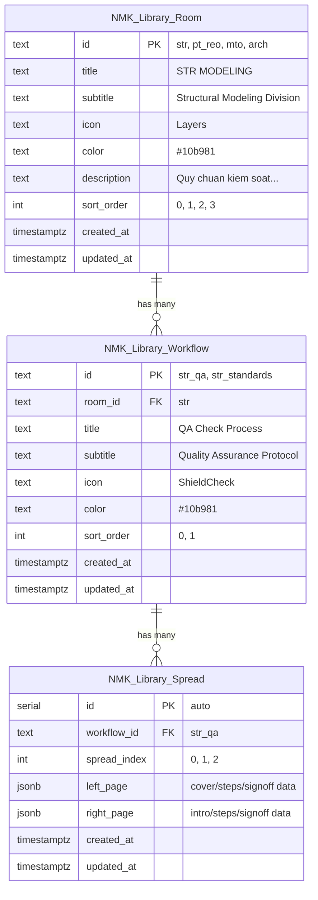

# UPDATE: Process → Library (Admin Editable Content + Supabase)

> **Version**: v5.1.0  
> **Date**: 2026-05-21  
> **Status**: PLANNING — Chờ duyệt  
> **Component**: Workflows.jsx → Library

---

## Tổng quan

Chuyển đổi trang **Process** (sidebar id: `workflows`) thành **Library** với:
1. **Rename sidebar** "Process" → "Library"
2. **Nội dung sách editable bởi Admin** thông qua Supabase
3. **Fix lỗi overlay** che nội dung trang sách (hình 2)

Hiện tại toàn bộ nội dung sách (~560 dòng) đang **hardcode** trong `Workflows.jsx` (lines 100-556). Không có kết nối Supabase nào cho phần này.

---

## Kiến trúc Supabase — 3 Bảng

```
NMK_Library_Room (Divisions)
  └── NMK_Library_Workflow (Books)
       └── NMK_Library_Spread (Pages — JSONB content)
```



---

## Bảng 1: `NMK_Library_Room` — Divisions

### Schema

| Cột | Kiểu | Constraint | Mô tả | Ví dụ |
|-----|------|-----------|-------|-------|
| `id` | `TEXT` | **PRIMARY KEY** | ID duy nhất, slug format | `'str'` |
| `title` | `TEXT` | `NOT NULL` | Tên division | `'STR MODELING'` |
| `subtitle` | `TEXT` | `NULL OK` | Phụ đề | `'Structural Modeling Division'` |
| `icon` | `TEXT` | `DEFAULT 'Layers'` | Tên Lucide icon | `'Layers'`, `'Zap'`, `'FileText'`, `'Home'` |
| `color` | `TEXT` | `DEFAULT '#10b981'` | Hex color | `'#10b981'`, `'#f59e0b'` |
| `description` | `TEXT` | `NULL OK` | Mô tả dài | `'Quy chuẩn kiểm soát...'` |
| `sort_order` | `INT` | `DEFAULT 0` | Thứ tự hiển thị | `0`, `1`, `2`, `3` |
| `created_at` | `TIMESTAMPTZ` | `DEFAULT now()` | Auto | — |
| `updated_at` | `TIMESTAMPTZ` | `DEFAULT now()` | Auto | — |

### Data mẫu — 4 Rooms

| id | title | subtitle | icon | color | sort_order |
|----|-------|----------|------|-------|------------|
| `str` | STR MODELING | Structural Modeling Division | Layers | #10b981 | 0 |
| `pt_reo` | PT & REO | Post-Tension & Reinforcement Division | Zap | #f59e0b | 1 |
| `mto` | MTO | Maker to order | FileText | #8b5cf6 | 2 |
| `arch` | ARCH | Architectural Coordination Division | Home | #3b82f6 | 3 |

---

## Bảng 2: `NMK_Library_Workflow` — Books

### Schema

| Cột | Kiểu | Constraint | Mô tả | Ví dụ |
|-----|------|-----------|-------|-------|
| `id` | `TEXT` | **PRIMARY KEY** | ID sách | `'str_qa'` |
| `room_id` | `TEXT` | **FK → Room(id)** `ON DELETE CASCADE` | Room chứa sách | `'str'` |
| `title` | `TEXT` | `NOT NULL` | Tên sách (spine) | `'QA Check Process'` |
| `subtitle` | `TEXT` | `NULL OK` | Phụ đề | `'Quality Assurance Protocol (Quy trình QA)'` |
| `icon` | `TEXT` | `DEFAULT 'ShieldCheck'` | Lucide icon | `'ShieldCheck'` |
| `color` | `TEXT` | `DEFAULT '#10b981'` | Màu bìa | `'#10b981'` |
| `sort_order` | `INT` | `DEFAULT 0` | Thứ tự trên kệ | `0`, `1` |
| `created_at` | `TIMESTAMPTZ` | `DEFAULT now()` | Auto | — |
| `updated_at` | `TIMESTAMPTZ` | `DEFAULT now()` | Auto | — |

### Data mẫu — 5 Workflows

| id | room_id | title | subtitle | icon | color | sort_order |
|----|---------|-------|----------|------|-------|------------|
| `str_qa` | str | QA Check Process | Quality Assurance Protocol (Quy trình QA) | ShieldCheck | #10b981 | 0 |
| `str_standards` | str | STR Modeling Standards | Modeling Rules & Shared Coordinates (Quy chuẩn dựng hình) | Layers | #047857 | 1 |
| `pt_complexity` | pt_reo | PT & REO Complexity | Heavy Shear Detailing (Cáp DƯL & Thép Đai) | Zap | #f59e0b | 0 |
| `mto_flow` | mto | Maker to order Flow | Concrete & Formwork Schedules (Bảng Thống Kê) | FileText | #8b5cf6 | 0 |
| `arch_coor` | arch | ARCH-STR Coordination | Slab Openings & Alignment (Phối Hợp Kiến Trúc) | Compass | #3b82f6 | 0 |

---

## Bảng 3: `NMK_Library_Spread` — Pages

### Schema

| Cột | Kiểu | Constraint | Mô tả |
|-----|------|-----------|-------|
| `id` | `SERIAL` | **PRIMARY KEY** | Auto-increment |
| `workflow_id` | `TEXT` | **FK → Workflow(id)** `ON DELETE CASCADE` | Sách chứa trang |
| `spread_index` | `INT` | `NOT NULL`, **UNIQUE(workflow_id, spread_index)** | Thứ tự trang (0-based) |
| `left_page` | `JSONB` | `NOT NULL` | Nội dung trang trái |
| `right_page` | `JSONB` | `NOT NULL` | Nội dung trang phải |
| `created_at` | `TIMESTAMPTZ` | `DEFAULT now()` | Auto |
| `updated_at` | `TIMESTAMPTZ` | `DEFAULT now()` | Auto |

### JSONB Schema — 4 loại trang

#### Type 1: `cover` — Trang bìa
```json
{
  "type": "cover",
  "title": "QA Check Process",
  "subtitle": "Quality Assurance Protocol (Quy trình QA)",
  "volume": "Vol. STR-I",
  "classification": "QUALITY AUDIT",
  "stampColor": "#10b981"
}
```

#### Type 2: `intro` — Trang giới thiệu
```json
{
  "type": "intro",
  "desc": "Quy trình 5 bước kiểm soát chất lượng tuyệt đối...",
  "meta": [
    { "label": "Bộ phận", "val": "STR Modeling Team" },
    { "label": "Quy chuẩn", "val": "QA-STR-2026" },
    { "label": "Bảo mật", "val": "HIGH CONFIDENTIAL" }
  ]
}
```

#### Type 3: `steps` — Trang các bước quy trình
```json
{
  "type": "steps",
  "title": "Steps 01 & 02",
  "steps": [
    {
      "step": "STEP 1",
      "titleEn": "RECEIVE MARKUP & FILE SETUP",
      "titleVn": "NHẬN MARKUP & TẠO FILE",
      "descEn": "When you receive the markup...",
      "descVn": "Khi nhận được bản markup...",
      "highlight": "NHAN",
      "icon": "FileText"
    }
  ]
}
```

#### Type 4: `signoff` — Trang xác nhận
```json
{
  "type": "signoff",
  "title": "Quality Verification",
  "checklist": [
    "Tên file tuân thủ quy định đặt tên",
    "Bản vẽ in giấy được tô màu đầy đủ",
    "Có chữ ký check chéo và đóng dấu",
    "Leader phê duyệt cuối cùng"
  ],
  "notes": "Tuyệt đối không bỏ qua các bước tô màu kiểm tra..."
}
```

---

## Ánh xạ Hardcode → Supabase (13 Spreads)

| # | workflow_id | spread | left_page | right_page |
|---|------------|--------|-----------|------------|
| 1 | str_qa | 0 | cover | intro |
| 2 | str_qa | 1 | steps (1,2) | steps (3,4) |
| 3 | str_qa | 2 | steps (5) | signoff |
| 4 | str_standards | 0 | cover | intro |
| 5 | str_standards | 1 | steps (STD01,02) | signoff |
| 6 | pt_complexity | 0 | cover | intro |
| 7 | pt_complexity | 1 | steps (TECH01,02) | steps (TECH03) |
| 8 | pt_complexity | 2 | signoff | cover (end) |
| 9 | mto_flow | 0 | cover | intro |
| 10 | mto_flow | 1 | steps (MTO01,02) | steps (MTO03) |
| 11 | mto_flow | 2 | signoff | cover (end) |
| 12 | arch_coor | 0 | cover | intro |
| 13 | arch_coor | 1 | steps (COOR01,02) | signoff |

---

## Frontend Query Patterns

### Lazy Loading (Đề xuất)
```javascript
// 1. Fetch rooms (màn hình chọn Division)
const { data: rooms } = await supabase
  .from('NMK_Library_Room')
  .select('*')
  .order('sort_order');

// 2. Fetch workflows khi chọn room (kệ sách)
const { data: workflows } = await supabase
  .from('NMK_Library_Workflow')
  .select('*')
  .eq('room_id', selectedRoomId)
  .order('sort_order');

// 3. Fetch spreads khi mở sách (page-flip content)
const { data: spreads } = await supabase
  .from('NMK_Library_Spread')
  .select('*')
  .eq('workflow_id', selectedWorkflowId)
  .order('spread_index');
```

### Preload ALL (tùy chọn)
```javascript
const { data: rooms } = await supabase
  .from('NMK_Library_Room')
  .select(`
    *,
    workflows:NMK_Library_Workflow (
      *,
      spreads:NMK_Library_Spread (*)
    )
  `)
  .order('sort_order');
```

---

## Admin CRUD Operations

### Upsert Room
```javascript
const upsertRoom = async (room) => {
  const { error } = await supabase
    .from('NMK_Library_Room')
    .upsert({ ...room, updated_at: new Date().toISOString() });
  if (error) throw error;
};
```

### Upsert Spread (Edit nội dung trang)
```javascript
const upsertSpread = async (workflowId, spreadIndex, leftPage, rightPage) => {
  const { error } = await supabase
    .from('NMK_Library_Spread')
    .upsert({
      workflow_id: workflowId,
      spread_index: spreadIndex,
      left_page: leftPage,
      right_page: rightPage,
      updated_at: new Date().toISOString()
    }, {
      onConflict: 'workflow_id,spread_index'
    });
  if (error) throw error;
};
```

### Delete Workflow (cascade xóa spreads)
```javascript
const deleteWorkflow = async (workflowId) => {
  const { error } = await supabase
    .from('NMK_Library_Workflow')
    .delete()
    .eq('id', workflowId);
  if (error) throw error;
};
```

---

## Icon Mapping (Frontend)

```javascript
import {
  FileText, Search, MousePointer2, CheckCircle2, Clock,
  Layers, Zap, Compass, Home, ShieldCheck, HelpCircle
} from 'lucide-react';

export const iconMap = {
  FileText, Search, MousePointer2, CheckCircle2, Clock,
  Layers, Zap, Compass, Home, ShieldCheck, HelpCircle
};

// Usage: const Icon = iconMap[iconName] || HelpCircle;
```

---

## RLS Policies

```sql
-- Read: tất cả user
CREATE POLICY "Library read" ON NMK_Library_Room FOR SELECT USING (true);
CREATE POLICY "Library read" ON NMK_Library_Workflow FOR SELECT USING (true);
CREATE POLICY "Library read" ON NMK_Library_Spread FOR SELECT USING (true);

-- Write: chỉ Admin
CREATE POLICY "Library admin write" ON NMK_Library_Room
  FOR ALL USING (
    EXISTS (SELECT 1 FROM NMK_User WHERE email = auth.email() AND role = 'admin')
  );
-- Tương tự cho Workflow và Spread
```

---

## Seed SQL Script

```sql
-- ROOMS
INSERT INTO NMK_Library_Room (id, title, subtitle, icon, color, description, sort_order) VALUES
('str',    'STR MODELING', 'Structural Modeling Division',           'Layers',   '#10b981', 'Quy chuẩn kiểm soát chất lượng mô hình 3D kết cấu...', 0),
('pt_reo', 'PT & REO',     'Post-Tension & Reinforcement Division', 'Zap',      '#f59e0b', 'Quản lý đường cáp dự ứng lực...', 1),
('mto',    'MTO',          'Maker to order',                        'FileText', '#8b5cf6', 'Thiết lập bảng thống kê khối lượng...', 2),
('arch',   'ARCH',         'Architectural Coordination Division',   'Home',     '#3b82f6', 'Phối hợp xử lý lỗ mở hộp kỹ thuật...', 3)
ON CONFLICT (id) DO NOTHING;

-- WORKFLOWS
INSERT INTO NMK_Library_Workflow (id, room_id, title, subtitle, icon, color, sort_order) VALUES
('str_qa',        'str',    'QA Check Process',        'Quality Assurance Protocol (Quy trình QA)',                  'ShieldCheck', '#10b981', 0),
('str_standards', 'str',    'STR Modeling Standards',   'Modeling Rules & Shared Coordinates (Quy chuẩn dựng hình)', 'Layers',      '#047857', 1),
('pt_complexity', 'pt_reo', 'PT & REO Complexity',      'Heavy Shear Detailing (Cáp DƯL & Thép Đai)',               'Zap',         '#f59e0b', 0),
('mto_flow',      'mto',   'Maker to order Flow',      'Concrete & Formwork Schedules (Bảng Thống Kê)',            'FileText',    '#8b5cf6', 0),
('arch_coor',     'arch',  'ARCH-STR Coordination',    'Slab Openings & Alignment (Phối Hợp Kiến Trúc)',           'Compass',     '#3b82f6', 0)
ON CONFLICT (id) DO NOTHING;

-- SPREADS (str_qa example — 3 spreads)
INSERT INTO NMK_Library_Spread (workflow_id, spread_index, left_page, right_page) VALUES
(
  'str_qa', 0,
  '{"type":"cover","title":"QA Check Process","subtitle":"Quality Assurance Protocol (Quy trình QA)","volume":"Vol. STR-I","classification":"QUALITY AUDIT","stampColor":"#10b981"}',
  '{"type":"intro","desc":"Quy trình 5 bước kiểm soát chất lượng tuyệt đối nhằm giảm thiểu tối đa sai sót trước khi xuất hồ sơ kỹ thuật kết cấu bê tông cốt thép tại Rincovitch.","meta":[{"label":"Bộ phận","val":"STR Modeling Team"},{"label":"Quy chuẩn","val":"QA-STR-2026"},{"label":"Bảo mật","val":"HIGH CONFIDENTIAL"}]}'
),
(
  'str_qa', 1,
  '{"type":"steps","title":"Steps 01 & 02","steps":[{"step":"STEP 1","titleEn":"RECEIVE MARKUP & FILE SETUP","titleVn":"NHẬN MARKUP & TẠO FILE","descEn":"When you receive the markup from the Manager/Leader, create a new file with your name added. EX: MARKUP-LOADING PLAN -> MARKUP-LOADING PLAN_NHAN","descVn":"Khi nhận được bản markup từ cấp trên, sao chép và tạo file làm việc mới có hậu tố tên mình.","highlight":"NHAN","icon":"FileText"},{"step":"STEP 2","titleEn":"HIGHLIGHT COMPLETED AREAS","titleVn":"TÔ MÀU VỊ TRÍ HOÀN THÀNH","descEn":"HIGHLIGHT the areas on the markup drawing that you have completed to keep precise track.","descVn":"Sử dụng bút màu TÔ MÀU trực tiếp lên các vị trí đã xử lý xong trên bản vẽ markup để kiểm soát.","highlight":"HIGHLIGHT","icon":"Search"}]}',
  '{"type":"steps","title":"Steps 03 & 04","steps":[{"step":"STEP 3","titleEn":"PRINT & SECOND HIGHLIGHT","titleVn":"IN RA VÀ TÔ MÀU LẦN 2","descEn":"After finishing, print out the drawing and HIGHLIGHT again on the physical drawing for absolute verification.","descVn":"Sau khi hoàn thành, in bản vẽ ra giấy và TÔ MÀU kiểm tra lần 2 lên bản cứng để soát lỗi.","highlight":"HIGHLIGHT AGAIN","icon":"MousePointer2"},{"step":"STEP 4","titleEn":"CROSS-CHECK & STAMPING","titleVn":"CHECK CHÉO & ĐÓNG DẤU","descEn":"Cross-check with other member. Checker must add a STAMP and save with name.","descVn":"Bàn giao cho đồng nghiệp check chéo. Người check thực hiện ĐÓNG DẤU xác nhận và lưu file kèm tên mình.","highlight":"STAMP","icon":"CheckCircle2"}]}'
),
(
  'str_qa', 2,
  '{"type":"steps","title":"Step 05","steps":[{"step":"STEP 5","titleEn":"FINAL MANAGER REVIEW","titleVn":"LEADER CHECK LẦN CUỐI","descEn":"Manager/Leader performs the absolute final review before formal issuance.","descVn":"Manager/Leader duyệt kỹ thuật tổng thể lần cuối trước khi chính thức phát hành bản vẽ.","highlight":"FINAL CHECK","icon":"Clock"}]}',
  '{"type":"signoff","title":"Quality Verification","checklist":["Tên file tuân thủ quy định đặt tên","Bản vẽ in giấy được tô màu đầy đủ","Có chữ ký check chéo và đóng dấu","Leader phê duyệt cuối cùng"],"notes":"Tuyệt đối không bỏ qua các bước tô màu kiểm tra. Đây là quy tắc vàng để bảo đảm bản vẽ không sót lỗi kỹ thuật."}'
)
ON CONFLICT (workflow_id, spread_index) DO NOTHING;

-- TODO: Thêm spreads cho str_standards, pt_complexity, mto_flow, arch_coor
```

---

## Fix Overlay Bug (Hình 2)

### Nguyên nhân
6 lớp gradient overlay trong Book Modal dùng `z-30` ~ `z-35` che nội dung page-flip:

| Dòng | z-index | Mô tả |
|------|---------|-------|
| 1184 | z-30 | Left edge crease |
| 1185 | z-30 | Right-of-left crease |
| 1187 | z-30 | Left-of-right crease |
| 1188 | z-30 | Right edge crease |
| 1191 | z-35 | Spine crease line |
| 1192-1193 | z-25/z-30 | Spine shadow gradients |

### Giải pháp
- Hạ z-index overlay từ `z-30` → `z-[1]`
- Giảm opacity gradient từ `black/[0.15]` → `black/[0.06]`
- Nâng z-index `.page-flip-book` lên `z-[5]`
- Thêm CSS cho `book-page-edges-left/right` (hiện thiếu)

---

## So sánh: Hardcode vs Supabase

| Khía cạnh | Hardcode | Supabase |
|-----------|---------|---------|
| Vị trí data | JSX (~560 dòng) | 3 bảng |
| Chỉnh sửa | Sửa code + deploy | Admin sửa qua UI |
| Thêm sách | Code thêm | Form thêm |
| Icon | Import Lucide | String → iconMap |
| Performance | Instant | Lazy load |
| Phân quyền | Không | RLS |
| Realtime | Không | Subscribe |
