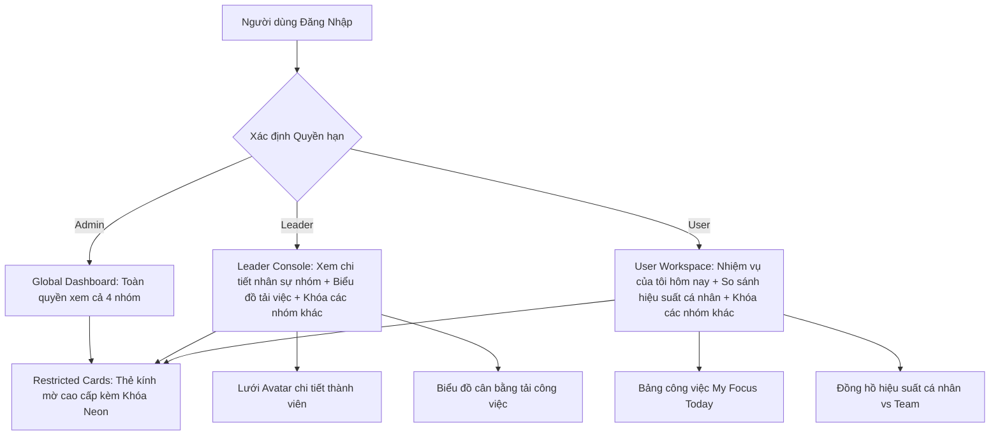

# Kế Hoạch Nâng Cấp Dashboard Dành Riêng Cho Team (Leader & User)

Tài liệu này lưu trữ phân tích chi tiết về thực trạng giao diện Dashboard hiện tại, xác định các điểm chưa làm (gaps), và đề xuất giải pháp kỹ thuật/thiết kế nâng cấp riêng biệt cho hai phân quyền **Team Leader** và **Team User (Member)**.

---

## 🔍 I. Phân Tích Thực Trạng (Đã Làm vs. Chưa Làm)

### 1. Thực Trạng Hiện Tại (Đã Làm)
*   **Xác định vai trò (Roles):** Hệ thống đã có cơ chế phân biệt `isAdmin` (Quản trị viên), `isLeader` (Trưởng nhóm), và `userTeam` (Tên nhóm của người dùng) được đồng bộ từ bảng `NMK_User` trong Supabase thông qua `AuthContext.jsx`.
*   **Bảo mật cơ bản (Team Isolation):** Các thẻ nhóm (Team Cards) trên Dashboard kiểm tra phân quyền thông qua thuộc tính `isVisible`. Nếu không phải Admin hoặc thành viên của nhóm đó, thẻ sẽ bị che mờ bằng một lớp overlay.
*   **Thống kê thụ động:** Hiện tại thẻ nhóm chỉ hiển thị các con số tổng quát (`BUSY`, `FREE`, `LEAVE`) và danh sách các tên dự án có nhiệm vụ hoạt động trong ngày hôm nay.

### 2. Các Điểm Chưa Làm & Khoảng Trống Bảo Mật (Chưa Làm)
*   ❌ **Thiếu Chi Tiết Thành Viên (Leader):** Trưởng nhóm chỉ thấy số lượng bận/rảnh chung (Ví dụ: `BUSY: 02`) nhưng **không thể biết chính xác ai đang làm dự án nào và ai đang rảnh**.
*   ❌ **Thiếu Không Gian Tập Trung Cá Nhân (User):** Các thành viên thông thường (Users) khi đăng nhập không có một khu vực tổng hợp nhanh công việc hôm nay của mình, số giờ đã làm trong tuần, và so sánh hiệu suất cá nhân với trung bình của team.
*   ❌ **Thiếu Biểu Đồ Cân Bằng Tải (Leader):** Trưởng nhóm không có công cụ trực quan để theo dõi sự phân bổ giờ làm giữa các thành viên, dẫn đến khó phát hiện tình trạng quá tải (bottleneck) hoặc phân bổ việc chưa đều.
*   ❌ **Rò Rỉ Dữ Liệu Bộ Lọc Biểu Đồ:** Người dùng thông thường vẫn có thể chọn xem thống kê số lượng task của bất kỳ nhóm nào khác thông qua dropdown Neumorphic ở phần biểu đồ xu hướng nhiệm vụ (Task Trends Chart).
*   ❌ **Giao Diện Khóa Quyền Hạn Thô Sơ:** Các thẻ nhóm bị hạn chế hiển thị lớp phủ mờ với dòng chữ `NO TASKS TODAY` rất thô sơ, tạo cảm giác hệ thống bị lỗi tải dữ liệu (No Data) thay vì bị khóa do không đủ quyền truy cập.

---

## 🛠️ II. Đề Xuất Giải Pháp Nâng Cấp Chi Tiết

---

## 📋 III. Kế Hoạch Triển Khai Kỹ Thuật

### 1. Thiết Kế Lại Thẻ Bị Khóa: Restricted Glassmorphic Card
*   Thay thế lớp phủ mờ cũ bằng một thiết kế **Kính mờ cao cấp (Glassmorphism)** đồng bộ:
    *   Sử dụng hiệu ứng blur sâu (`backdrop-blur-xl`), viền sáng mỏng tinh tế.
    *   Hiển thị một biểu tượng ổ khóa Neon phát sáng nhẹ màu hổ phách/vàng kim.
    *   Dòng chữ thông báo sang trọng: `Restricted Access • Management Only` (Chỉ dành cho Ban Quản Lý).

### 2. Giao Diện Cho TEAM LEADER (Leader Console)
Leader của một nhóm (Ví dụ: nhóm `PT&REO`) khi xem thẻ của nhóm mình sẽ nhận được các tính năng nâng cao:
*   **Lưới Nhân Sự Chi Tiết (Active Member Grid):** Thay thế giao diện đếm số thụ động bằng danh sách Avatar thu nhỏ của các thành viên trong nhóm kèm trạng thái trực quan:
    *   🔵 **Bận (Working):** Avatar sáng viền xanh lá + Hiện mã dự án đang làm ngày hôm nay (Ví dụ: `SUR`). Hover vào sẽ hiện tooltip tên nhiệm vụ chi tiết.
    *   🟢 **Rảnh (Available):** Avatar viền nét đứt màu xám + nút bấm nhanh để ping hoặc gán việc.
    *   🟡 **Nghỉ phép (Leave):** Avatar tối màu + Hiện ngày quay trở lại làm việc.
*   **Biểu Đồ Cân Bằng Tải Nội Bộ (Workload Balance Chart):**
    *   Tích hợp một biểu đồ thanh ngang (Horizontal Bar Chart) cực kỳ gọn gàng hiển thị tổng số giờ làm việc đã log của từng thành viên trong tuần hiện tại để giúp Leader tối ưu hóa nguồn lực.

### 3. Giao Diện Cho USER (Personal Workspace)
Khi người dùng thông thường đăng nhập, giao diện Dashboard sẽ tự động bổ sung một vùng làm việc cá nhân cao cấp thay thế cho việc chỉ xem thẻ nhóm thụ động:
*   **Tiêu Điểm Hôm Nay (My Focus Today Widget):**
    *   Bảng danh sách nhiệm vụ được gán cho chính User trong ngày hôm nay với trạng thái (Đang làm/Hoàn thành).
    *   Tích hợp nút cập nhật trạng thái nhanh (Quick Check-in / Checkout).
*   **Đồng Hồ Đo Hiệu Suất Cá Nhân (Personal Benchmark Ring):**
    *   Một vòng tròn tiến độ 3D (Circular Progress Ring) hiển thị tỷ lệ hoàn thành giờ làm việc mục tiêu cá nhân trong tuần và so sánh trực tiếp với mức trung bình của toàn nhóm.

### 4. Thắt Chặt Bảo Mật Bộ Lọc Dữ Liệu (Chart Security Constraints)
*   Chỉnh sửa component bộ chọn `chartTeam` ở biểu đồ Trend dưới cùng:
    *   **Admin:** Dropdown mở hoàn toàn, có thể chọn `ALL` hoặc bất kỳ nhóm nào.
    *   **Leader / User:** Dropdown sẽ bị khóa cứng (disabled) hoặc chỉ hiển thị duy nhất lựa chọn là tên nhóm của chính họ (Ví dụ: `PT & REO` hoặc `ENGINEER`) để tránh việc xem lén số liệu của các nhóm khác.

---

## 🎯 IV. Kế Hoạch Xác Minh (Verification Plan)

### 1. Kiểm Thử Trình Duyệt Tự Động (Browser Automation)
- Sử dụng subagent chạy các kịch bản test đăng nhập dưới 3 quyền hạn khác nhau để chụp ảnh giao diện và đảm bảo:
  - **Admin Mode:** Thấy đầy đủ cả 4 nhóm hoạt động.
  - **Leader Mode:** Thấy chi tiết Avatar thành viên của nhóm mình, các nhóm khác bị khóa bằng giao diện khóa Neon sang trọng.
  - **User Mode:** Thấy tiêu điểm cá nhân "My Focus Today" và không thể chọn xem biểu đồ của nhóm khác.

### 2. Kiểm Thử Chức Năng (Manual Verification)
- Xác nhận các sự kiện hover và click trên các avatar của thành viên hiển thị tooltip chính xác.
- Đảm bảo dữ liệu số giờ làm việc được tính toán chính xác thông qua `performanceEngine.js` và đồng bộ tức thời khi chuyển đổi các tab tuần/tháng.
