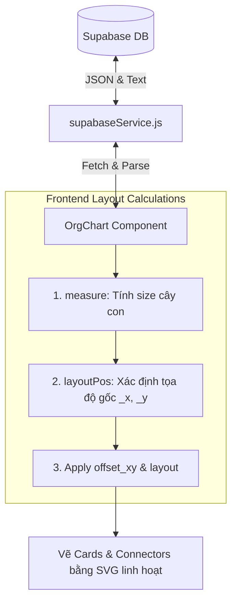

# Phân Tích Chuyên Sâu Kế Hoạch Nâng Cấp: Sơ Đồ Tổ Chức (Drag & Drop OrgChart)

Báo cáo này phân tích chi tiết tính khả thi, kiến trúc kỹ thuật, các thách thức tiềm ẩn và phương án tối ưu hóa khi triển khai tính năng **Kéo thả tự do & Thay đổi Layout Sơ đồ Tổ chức** theo tài liệu kế hoạch [ORG_CHART_DRAG_DROP_PLAN.md](file:///c:/Users/Nhan/OneDrive%20-%20Rincovitch/00.%20Nhan/CSharp/REPORT/Report/core/ORG_CHART_DRAG_DROP_PLAN.md).

---

## 📊 1. Đánh Giá Khả Thi & Kiến Trúc Tổng Thể

Kiến trúc hiện tại của [OrgChart.jsx](file:///c:/Users/Nhan/OneDrive%20-%20Rincovitch/00.%20Nhan/CSharp/REPORT/Report/src/components/OrgChart.jsx) sử dụng bộ công cụ **2-pass Layout Engine** rất chuẩn chỉ (`measure` và `layoutPos`). Bộ định vị này tính toán kích thước bao của cây con (`_sw`, `_sh`) và áp các tọa độ tuyệt đối cục bộ (`_x`, `_y`) cho từng node.

### Mô Hình Dữ Liệu Sau Khi Nâng Cấp:


---

## 🛠️ 2. Phân Tích Chi Tiết Các Bước Kỹ Thuật

### 2.1. Cập Nhật Database (Supabase)
Việc thêm 2 trường `layout` và `offset_xy` vào bảng `NMK_User` là giải pháp lưu trữ tối ưu:
- **`layout` (text)**: Chỉ nhận các giá trị `'horizontal'` hoặc `'vertical'`.
- **`offset_xy` (text/json)**: Lưu dưới dạng chuỗi JSON `{"x": dx, "y": dy}` đại diện cho độ lệch (offset) so với vị trí tự động tính toán từ Layout Engine. Điều này giúp sơ đồ tự động căn chỉnh lại nếu có nhân sự mới được thêm vào, mà không phá vỡ cấu trúc tổng thể.

### 2.2. Xử Lý Phép Toán Tọa Độ Kéo Thả (Hệ số Zoom)
> [!WARNING]
> **Thách thức lớn nhất:** Hiện tại, Canvas của sơ đồ tổ chức có tính năng Pan & Zoom (từ `0.25` đến `3.0`).
> Nếu ta lấy trực tiếp chênh lệch chuột `clientX` để cộng vào tọa độ thẻ khi đang Zoom, thẻ sẽ bị **"trượt" hoặc "chạy nhanh hơn chuột"**.

**Công thức chuẩn hóa tọa độ khi Drag & Zoom:**
$$Offset_{new} = Offset_{old} + \frac{\Delta Mouse}{Zoom}$$

Trong code React, ta cần xử lý trong sự kiện `MouseMove`:
```javascript
const dx = (e.clientX - dragStart.x) / zoom;
const dy = (e.clientY - dragStart.y) / zoom;
```

### 2.3. Vẽ Đường Nối (SVG Connectors) Động
Hiện tại, hàm `collectAll` đang vẽ các đường kết nối thẳng hoặc L-shape dựa trên tọa độ tĩnh (`node._x` và `node._y`).
Để các đường nối "dính" chặt vào thẻ khi thẻ bị kéo đi chỗ khác, ta phải cập nhật tọa độ thực tế của đầu ra/đầu vào dựa trên tọa độ đã áp offset:

$$\text{Tọa độ vẽ thực tế} = \text{Tọa độ gốc (_x, _y)} + \text{Offset (x, y)}$$

- **Parent center bottom:** `pcx = parent._x + parentOffset.x + CARD_W / 2`
- **Child center top:** `ccx = child._x + childOffset.x + CARD_W / 2`

---

## 💡 3. Các Đóng Góp Nâng Cấp Cao Cấp (Wow Factors)

Để mang lại trải nghiệm cực kỳ cao cấp đúng chuẩn **Premium UI/UX**, tôi đề xuất bổ sung thêm các điểm tối ưu hóa sau:

1. **Hiệu Ứng Snap-to-Grid (Hít lưới):** 
   Khi người dùng thả chuột ở gần vị trí thẳng hàng, hệ thống tự động làm tròn offset về bội số của `10px` để sơ đồ trông luôn vuông vắn, ngăn nắp.
2. **Nút "Reset Layout":**
   Bổ sung một nút trên TopBar để xóa toàn bộ `offset_xy` của tất cả các node về `null`, đưa sơ đồ về trạng thái tự động sắp xếp ban đầu một cách nhanh chóng.
3. **Phản hồi Thị giác (Visual Drag Feedback):**
   Khi đang kéo thẻ, các đường nối liên quan sẽ chuyển sang màu nét đứt mờ (dashed line) hoặc phát sáng nhẹ để người dùng dễ theo dõi mối quan hệ cha-con.
4. **Tránh Quá Tải API (Debouncing DB updates):**
   Thay vì gửi request Supabase liên tục ở mỗi pixel di chuyển chuột, ta chỉ thực thi lưu xuống DB ở sự kiện `onMouseUp` (khi người dùng thả thẻ ra).

---

## 📅 4. Kế Hoạch Triển Khai (Execution Steps)

Để triển khai an toàn không gây lỗi hệ thống, chúng ta sẽ đi theo trình tự sau:

| Bước | Nội dung công việc | Rủi ro | Giải pháp phòng ngừa |
| :--- | :--- | :--- | :--- |
| **1** | Cập nhật cấu trúc bảng `NMK_User` trên Supabase SQL Editor. | Lỗi DB không nhận cột mới khi code React gọi API. | Thực hiện và test API select trước khi code giao diện. |
| **2** | Tích hợp các cột mới vào `supabaseService.js` và viết hàm cập nhật `updateUserOrgNode`. | Lỗi ép kiểu dữ liệu JSON. | Khởi tạo giá trị mặc định an toàn khi parse JSON. |
| **3** | Cập nhật logic render tọa độ có áp dụng Offset trong [OrgChart.jsx](file:///c:/Users/Nhan/OneDrive%20-%20Rincovitch/00.%20Nhan/CSharp/REPORT/Report/src/components/OrgChart.jsx). | Lệch đường nối SVG. | Viết lại hàm tính toán tọa độ điểm kết nối động. |
| **4** | Code các sự kiện Drag chuột (`onMouseDown`, `MouseMove`, `onMouseUp`) kết hợp chia tỉ lệ `zoom`. | Trải nghiệm kéo bị giật, trượt chuột. | Tách biệt State kéo cục bộ (60fps) và State đồng bộ DB. |
| **5** | Thêm nút Toggle Layout và Reset vị trí. | Nút bấm chồng chéo lên thẻ. | Cải tiến Hover actions panel trên thẻ con. |

---
*Báo cáo phân tích bởi Antigravity AI Code Assistant.*
