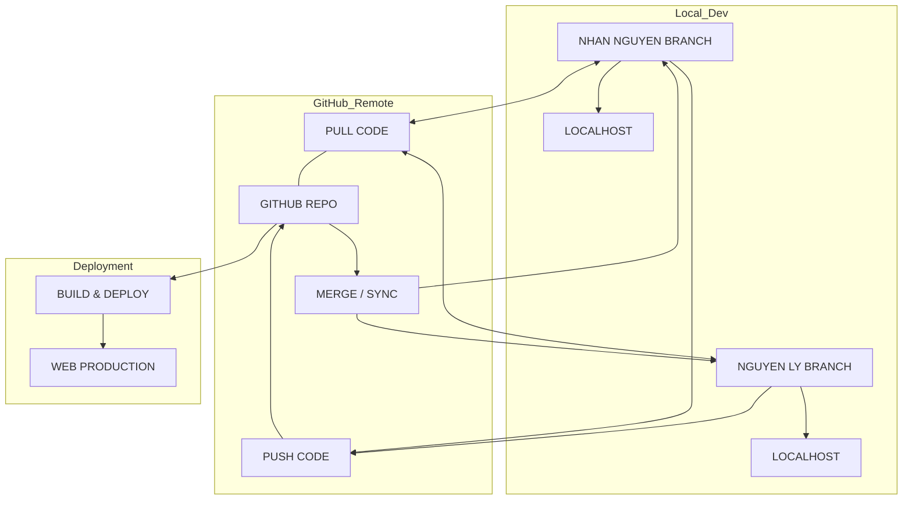

# RINCOVITCH REPORT - QUY TRÌNH HỢP TÁC GIT & TRIỂN KHAI

Dựa trên sơ đồ quy trình hệ thống đã thống nhất, đây là bản hướng dẫn chi tiết để đảm bảo code luôn ổn định và đồng bộ giữa các thành viên.

## 1. Sơ đồ Quy trình (Workflow Diagram)

---

## 2. Cấu trúc Nhánh (Branch Strategy)

### 🟢 Nhánh `main` (Nhánh Sản phẩm)
- **Mục đích**: Chứa mã nguồn "sạch" nhất đang chạy trên môi trường **WEB**.
- **Quy tắc**: Chỉ được Merge từ các nhánh cá nhân sau khi Nhan Nguyen đã kiểm tra.

### 🔵 Nhánh `nhan-workspace` (Developer: Nhan Nguyen)
- **Mục đích**: Nhánh làm việc chính của Nhan và AI.
- **Quy trình**: 
    - Code trên Localhost -> `PUSH` lên GitHub.
    - `PULL` code từ GitHub về để cập nhật.

### 🟡 Nhánh `ly-workspace` (Developer: Nguyen Ly)
- **Mục đích**: Nhánh làm việc của cộng sự (Nguyen Ly).
- **Quy trình**:
    - Code trên Localhost -> `PUSH` lên GitHub.
    - Nhận code mới thông qua quy trình `MERGE` từ `main`.

---

## 3. Các bước vận hành hàng ngày

1. **Bắt đầu ngày mới (PULL)**: 
   - Luôn thực hiện `git pull origin nhan-workspace` (hoặc ly-workspace) để đảm bảo bạn đang ở bản mới nhất.
2. **Phát triển (LOCAL)**: 
   - Code và test trực tiếp trên `LOCALHOST`.
3. **Cập nhật (PUSH)**: 
   - Sau khi hoàn thành tính năng, thực hiện `PUSH` lên nhánh tương ứng trên GitHub.
4. **Hợp nhất (MERGE)**:
   - Khi muốn gộp code của Ly vào Nhan hoặc ngược lại, phải thông qua GitHub (Pull Request).
   - Sau khi Merge xong, GitHub sẽ tự động thực hiện quy trình **BUILD & DEPLOY**.

---

## 4. Quy trình Đẩy lên Web (Build & Deploy)

1. **Trigger**: Lệnh `Merge` vào nhánh `main` (hoặc nhánh được cấu hình deploy) sẽ kích hoạt quy trình tự động.
2. **Build**: Hệ thống GitHub Actions sẽ chạy lệnh `npm run build` để đóng gói ứng dụng.
3. **Deploy**: File build sẽ được đẩy lên server (Vercel/Netlify/Host) để cập nhật nội dung trên **WEB**.

---
> [!IMPORTANT]
> Tuyệt đối không `PUSH` trực tiếp code lỗi lên GitHub. Luôn kiểm tra kỹ trên **LOCALHOST** trước khi thực hiện PUSH.

*Vị trí file này: /core/git_collaboration_plan.md*
