# Kế Hoạch Triển Khai MCP (Model Context Protocol) 🚀

Bản kế hoạch này cung cấp kiến trúc, thiết kế cú pháp và lộ trình triển khai chi tiết giúp bạn kết nối trực tiếp AI Model (LLM) với Database Supabase của ứng dụng **Weekly Report & Intelligence Dashboard**, cho phép đồng bộ hai chiều thời gian thực cực kỳ mạnh mẽ.

---

## 1. Tổng Quan Về Kiến Trúc MCP (Model Context Protocol)
**Model Context Protocol (MCP)** là một giao thức chuẩn mở (được phát triển bởi Anthropic và cộng đồng công nghệ) cho phép các LLM (như Gemini, Claude) kết nối an toàn với các nguồn dữ liệu, công cụ và API bên ngoài thông qua kiến trúc Client-Server.

### 🌐 Sơ đồ luồng hoạt động đồng bộ 2 chiều:

```mermaid
sequenceDiagram
    autonumber
    actor User as Người dùng
    participant LLM as AI Assistant (Cursor/Gemini)
    participant MCP as MCP Server (NodeJS)
    participant DB as Supabase (PostgreSQL)
    participant Web as React Web App (Vite)

    %% Luồng 1: Đồng bộ từ LLM -> Web App
    rect rgb(30, 41, 59)
        Note over User, Web: Luồng 1: AI cập nhật kế hoạch lên Web
        User->>LLM: Nhập kế hoạch dạng text: "•DLD L5 to L10 => Issue 18/05"
        LLM->>MCP: Gọi Tool: `parse_and_sync_plan(text)`
        MCP->>DB: Thực hiện INSERT / UPDATE vào `NMK_Task`
        DB-->>Web: Supabase Realtime kích hoạt (Postgres Changes)
        Web->>Web: Tự động cập nhật UI tức thì (Không cần reload)
    end

    %% Luồng 2: Đồng bộ từ Web App -> LLM
    rect rgb(15, 23, 42)
        Note over User, Web: Luồng 2: Web App thay đổi -> AI nhận biết
        User->>Web: Thay đổi trạng thái Task thành "DONE" trên UI
        Web->>DB: Gửi UPDATE lên Supabase
        User->>LLM: "Kiểm tra tiến độ hiện tại của tôi"
        LLM->>MCP: Gọi Tool: `get_current_workload()`
        MCP->>DB: Query các task mới nhất
        DB-->>LLM: Trả về trạng thái thực tế
        LLM-->>User: "Bạn đã hoàn thành dự án..."
    end
```



---

## 2. Gợi Ý Model Hoạt Động Hiệu Quả Nhất
Để chạy MCP mượt mà, bạn nên sử dụng các mô hình hỗ trợ mạnh mẽ về **Function Calling (Tool Use)** và khả năng phân tích cú pháp xuất sắc:
1. **Claude 3.5 Sonnet (Được khuyên dùng hàng đầu)**: Khả năng gọi tool MCP chính xác gần như tuyệt đối, phân tích cấu trúc cú pháp phức tạp rất nhạy bén.
2. **Gemini 1.5 Pro / Gemini 2.0 Flash**: Tốc độ xử lý cực kỳ nhanh, hỗ trợ context window khổng lồ giúp đọc toàn bộ database schema dễ dàng.
3. **GPT-4o**: Tính toán logic và lập kế hoạch rất tốt.

---

## 3. Thiết Kế Cú Pháp Tạo Kế Hoạch Tự Động (DSL - Domain Specific Language)
Để AI và bạn có thể tự tạo kế hoạch theo một cú pháp cố định nhưng vẫn tự nhiên, chúng ta sẽ thiết kế bộ cú pháp chuẩn hóa sau:

### ✍️ Cú pháp định dạng:
```text
•[MÃ DỰ ÁN] 
[Chi tiết công việc / Level] => [Mốc thời gian Timestamp] => [Hạn nộp / Issue Date]
```

### 📝 Ví dụ thực tế:
```text
•DLD
Level 5 to level 10 => TIMESTAMP (NODAY – NO TIME) => Issue today 18/05/2026 (17:30)
Level 11 to level 17 => TIMESTAMP (NODAY – NO TIME) => Issue date 22/05/2026 (17:30)

•FGWB
PT markup => TIMESTAMP (20/05/2026 – NO TIME) => Issue date 20/05/2026 (17:30)
```

### 🧠 Bộ phân dịch tự động (Parser Logic) trong MCP Server:
MCP Server sẽ dùng Regex hoặc LLM Sub-call để bóc tách chuỗi trên thành dạng JSON chuẩn hóa trước khi đẩy lên Supabase:
```json
{
  "project_key": "DLD",
  "task_name": "LEVEL 5 TO LEVEL 10",
  "timestamp_date": null,
  "timestamp_time": null,
  "issue_date": "2026-05-18",
  "issue_time": "17:30",
  "status": "WIP"
}
```

---

## 4. Thiết Kế Kỹ Thuật MCP Server (NodeJS / TypeScript)
Do dự án của bạn đang được viết bằng **JavaScript/React**, việc phát triển MCP Server bằng **NodeJS & TypeScript** sử dụng `@modelcontextprotocol/sdk` là tối ưu nhất.

### 🛠️ Các API Tools mà MCP Server sẽ cung cấp cho LLM:
1. `parse_plan_syntax(rawText)`: Nhận chuỗi text kế hoạch từ người dùng, bóc tách thành các đối tượng JSON.
2. `sync_tasks_to_supabase(tasks)`: Nhận mảng nhiệm vụ và thực hiện lệnh Upsert (thêm mới hoặc cập nhật) trực tiếp vào bảng `NMK_Task` và `NMK_Project` trên Supabase.
3. `get_current_workload(filters)`: Lấy dữ liệu công việc hiện tại từ Supabase về để LLM phân tích và báo cáo cho người dùng.

---

## 5. Lộ Trình Triển Khai Chi Tiết (Roadmap)

### 📍 Bước 1: Khởi tạo Project MCP Server
Tạo một thư mục độc lập `mcp-supabase-server` trong workspace của bạn:
```bash
npm init -y
npm install @modelcontextprotocol/sdk @supabase/supabase-js dotenv typescript
npx tsc --init
```

### 📍 Bước 2: Viết mã nguồn cho MCP Server (`index.ts`)
Thiết lập kết nối với Supabase bằng `supabase-js` và đăng ký các Tool MCP.
*Khi AI gọi Tool, MCP sẽ trực tiếp thực thi truy vấn tới database Supabase của bạn bằng các khóa API đã cấu hình.*

### 📍 Bước 3: Cấu hình Client (Ví dụ: Cursor / VS Code / Claude Desktop)
Cấu hình file thiết lập của editor (ví dụ: `project.config` hoặc cấu hình toàn cục của Claude Desktop):
```json
{
  "mcpServers": {
    "supabase-planner": {
      "command": "node",
      "args": ["C:/Users/Nhan/OneDrive - Rincovitch/00. Nhan/CSharp/REPORT/Report/mcp-supabase-server/dist/index.js"],
      "env": {
        "SUPABASE_URL": "YOUR_SUPABASE_URL",
        "SUPABASE_ANON_KEY": "YOUR_SUPABASE_KEY"
      }
    }
  }
}
```

### 📍 Bước 4: Kiểm thử đồng bộ 2 chiều
1. **Từ AI sang Web:** Bạn nói với AI: *"Hãy lên kế hoạch dự án MORAY L5-L10 nộp vào thứ Tư lúc 17h30"*. AI tự nhận diện, gọi tool MCP ghi vào database. Trang Web của bạn đang chạy sẽ tự động cập nhật dòng mới nhờ Supabase Realtime!
2. **Từ Web sang AI:** Bạn kéo thả, đổi màu hoặc thêm task trên giao diện Web. Sau đó quay lại hỏi AI: *"Hãy tóm tắt lịch trình tuần này của tôi"*. AI sẽ tự động đọc trực tiếp dữ liệu mới nhất từ Supabase qua MCP và báo cáo chuẩn xác.

---

> [!TIP]
> Việc xây dựng MCP Server này sẽ biến trợ lý AI của bạn thành một **"Operational Co-pilot"** thực thụ – không chỉ viết code mà còn trực tiếp quản lý, cập nhật và đồng bộ hóa dòng chảy công việc của cả đội ngũ của bạn theo thời gian thực!
